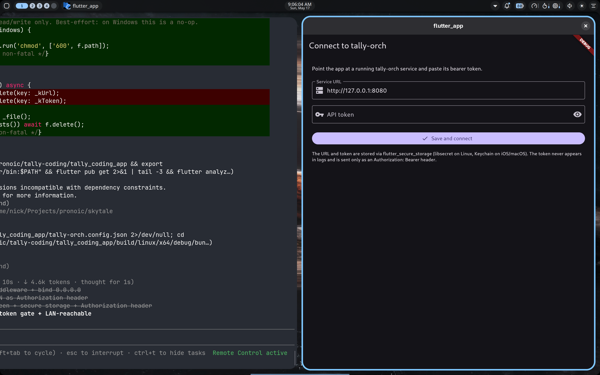
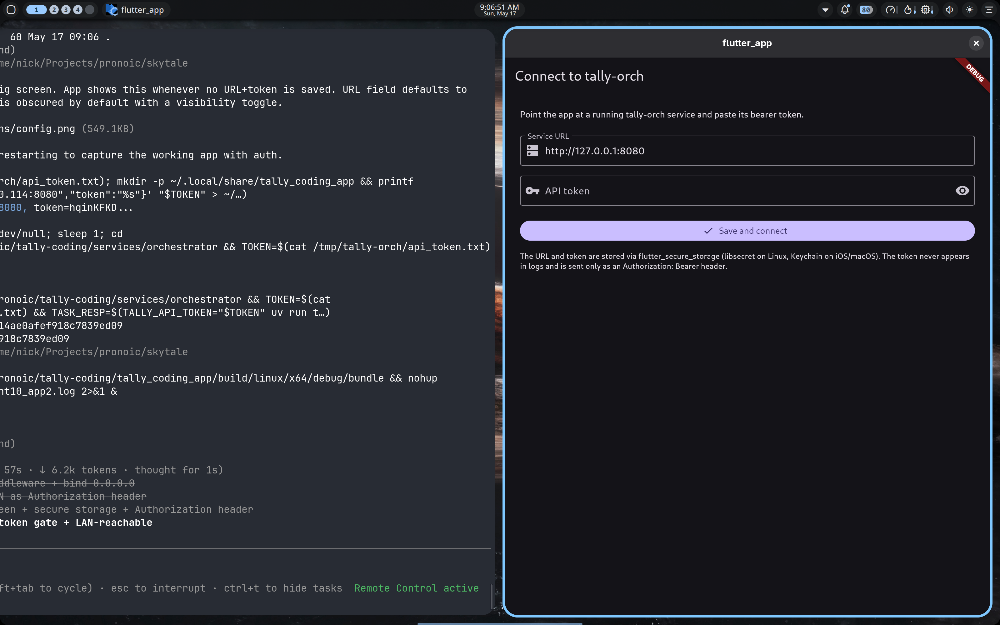

# Sprint 10 — Bearer auth + LAN exposure

**Status: PASS** — `tally-orch` now requires `Authorization: Bearer <token>` on
every `/tasks*` endpoint and binds to `0.0.0.0` by default so LAN devices can
reach it. The Flutter app gates on a one-time config screen that captures
URL + token and stores them locally.

This sprint deliberately uses static bearer-token auth (not Clerk OIDC).
Reasoning at the top of the doc: full OIDC integration (Clerk app provisioning
+ hosted sign-in + redirect handling + JWKS verification + Flutter SDK) is
2–3 sprints by itself; bearer-token closes the privacy gap today and the wire
format (`Authorization: Bearer ...`) swaps to Clerk-issued JWTs in a future
sprint with no client changes outside the login screen.

| Config screen | Connected (LAN IP + token) |
|---|---|
|  |  |

## What was built

**Service (`tally_orchestrator/service.py`):**

- New imports: `hmac`, `secrets`, `Depends`, `HTTPBearer`,
  `HTTPAuthorizationCredentials`.
- `_resolve_token(db_dir)` — token resolution order:
  1. `TALLY_API_TOKEN` env if set
  2. `<db_dir>/api_token.txt` if present (persisted across restarts)
  3. Generate `secrets.token_urlsafe(32)`, write to that file (0600), log
     once at WARNING level so the operator sees it
- `require_token(creds)` — FastAPI dependency that 401s any request whose
  `Authorization` header is missing or whose bearer credential doesn't
  match `state["api_token"]`. Constant-time compare via `hmac.compare_digest`.
- Lifespan calls `_resolve_token(Path(db_path).parent)` once at startup and
  stashes the value in `state["api_token"]`.
- Every `/tasks*` route now has `dependencies=[Depends(require_token)]`.
  `/health` stays open (for LB / monitor probes).
- `main()` default `HOST` flipped from `127.0.0.1` to `0.0.0.0`. Set
  `HOST=127.0.0.1` to lock down to localhost.

**CLI (`tally_orchestrator/cli.py`):**

- New `--token` flag and `TALLY_API_TOKEN` env var. Each subcommand opens
  an `httpx.Client(base_url, headers={authorization: Bearer ...})` and uses
  relative paths.
- 401 → friendly error: `"error: 401 unauthorized — set TALLY_API_TOKEN"`,
  exit 1.

**Flutter app:**

- `lib/config.dart` (new): `Config(url, token)` + `ConfigStore` that reads /
  writes a single JSON file under `getApplicationSupportDirectory()` (on
  Linux: `~/.local/share/tally_coding_app/tally-orch.config.json`). The file
  is `chmod 600` after every write.
  - Initial design used `flutter_secure_storage`, but its Linux backend
    bundles an outdated `nlohmann/json` header that newer Clang treats as
    an error (`-Werror -Wdeprecated-literal-operator`). Path-provider +
    0600 JSON has the same spike-grade properties (owner-only readable on
    disk) without the vendored-header foot-gun. Will revisit when the app
    targets mobile, where Keychain / Keystore is the right backend.
- `lib/screens/config_screen.dart` (new): URL + token TextFields with the
  token field obscured by default and a visibility toggle.
- `lib/main.dart`: `_Boot` widget loads the config asynchronously; shows
  loading → config screen (if incomplete) → main app (`TaskListScreen` or
  `TaskDetailScreen` for the deep-link case).
- `lib/api.dart`: `TallyOrchClient` takes a `token` parameter and adds
  `Authorization: Bearer <token>` to every request (incl. the SSE
  long-poll). New `UnauthorizedException` type. 401 from any endpoint
  surfaces as that exception so the UI can route to "reconfigure".

## E2E run

- Worker CVM: `a8b2b4d9-d15c-4a32-84df-74f43a73551c` (worker:v8 unchanged)
- TEAM_ID: `tally-sprint10-1779026462`
- Service: bound `0.0.0.0:8080`, auto-generated token persisted to
  `/tmp/tally-orch/api_token.txt`
- Auth gate tested via curl:
  - `GET /tasks` (anon) → `401 {"detail":"missing or invalid bearer token"}`
  - `GET /tasks` w/ Bearer (localhost) → `200 []`
  - `GET /tasks` w/ Bearer (LAN IP 192.168.20.114) → `200 []`
  - `GET /health` (anon) → `200 OK`
- CLI: `TALLY_API_TOKEN=... uv run tally task submit "Create palindrome.py..."`
  succeeded; task ID `b8f88e26d6e14ae0afef918c7839ed09`
- Flutter app:
  - First launch with no config → config screen rendered (screenshot)
  - Seeded config with LAN URL + token, restarted → list view shows the
    task submitted via CLI (screenshot)
  - Every API call going out includes the Authorization header

## Wire format

```
GET  /health                              ← open
GET  /tasks                               ← requires Authorization: Bearer <token>
POST /tasks                               ← requires
GET  /tasks/{id}                          ← requires
GET  /tasks/{id}/events?since_seq=N       ← requires
GET  /tasks/{id}/stream                   ← requires (SSE; auth happens before
                                            the stream opens)
GET  /tasks/{id}/files                    ← requires
GET  /tasks/{id}/files/{path}             ← requires
```

Same shape as a Clerk-issued JWT would use, so the Clerk integration only
has to swap the verification function inside `require_token()` to check
JWT signature against Clerk's JWKS (and trust the `sub` claim as the user
identity). The wire stays put.

## Open items

1. **Static single-user token.** Loses the multi-user property entirely.
   Real OIDC needed before any "share with a teammate" UX.
2. **No token rotation.** Restart the service with a different
   `TALLY_API_TOKEN` env to rotate; clients re-enter via the config
   screen. A "rotate token" endpoint (auth'd of course) would be a small
   addition.
3. **HTTP not HTTPS on LAN.** Bearer over plain HTTP on a trusted LAN is
   adequate; over the internet it's not. Tunneling via cloudflared /
   tailscale (which gives mTLS + a stable hostname) is the right step
   before public exposure.
4. **No mobile build attempted.** Linux desktop binary tested; iOS /
   Android need their own `getApplicationSupportDirectory` paths (which
   path_provider already handles) plus signing.
5. **`flutter_secure_storage` dropped.** Linux backend was broken by
   newer Clang. Worth retrying when the upstream bundles a newer
   `nlohmann/json` header, or before shipping mobile builds (where it
   correctly wraps Keychain / Keystore).

## Files changed

- `services/orchestrator/tally_orchestrator/service.py` (+50): auth dep,
  token resolution, `HOST=0.0.0.0` default
- `services/orchestrator/tally_orchestrator/cli.py` (+25): `--token`, env,
  httpx.Client with auth headers
- `tally_coding_app/pubspec.yaml`: swap flutter_secure_storage → path_provider
- `tally_coding_app/lib/config.dart` (new, ~60 LoC): JSON-file Config store
- `tally_coding_app/lib/screens/config_screen.dart` (new, ~90 LoC)
- `tally_coding_app/lib/main.dart` (rewrite): boot through ConfigStore
- `tally_coding_app/lib/api.dart` (+25): token field, Authorization header
  on every request, UnauthorizedException

Worker / image unchanged (`:v8`).

## Next sprint candidates

1. **Cloudflared / Tailscale tunnel** — secure remote (non-LAN) access; the
   service already speaks the right wire format, just needs HTTPS in front
   of it
2. **Clerk OIDC** — swap the static token for real user JWTs; multi-user
3. **Mobile build** — iOS / Android targets for `tally_coding_app`
4. **Worker pool** for concurrent tasks
