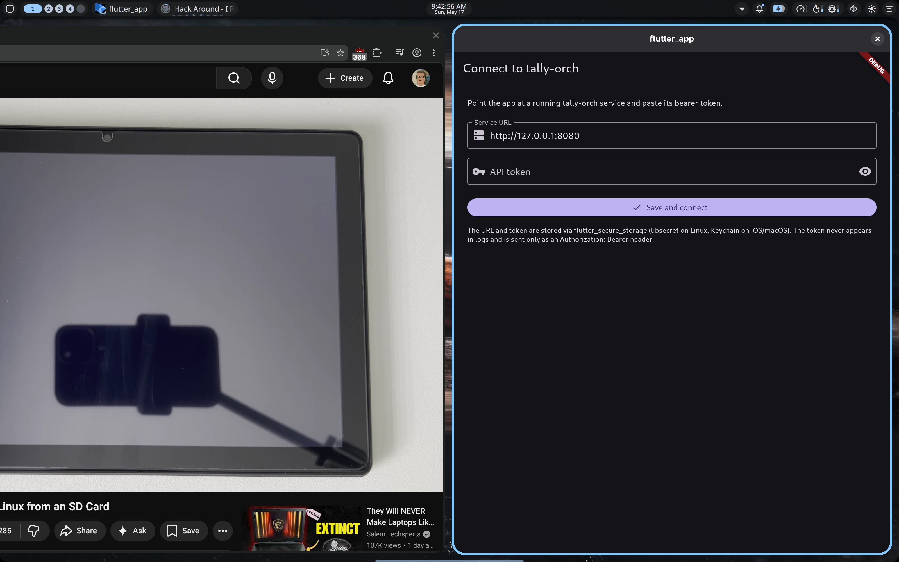

# Sprint 11 — Cloudflare Tunnel + systemd

**Status: PASS** — `tally-orch` is now reachable at
**https://tally.pronoic.dev** with proper HTTPS (Cloudflare-issued cert at
the edge, QUIC tunnel to localhost). Both `tally-orch` and `cloudflared`
run as `systemctl --user` units so they survive reboot. The Sprint 10
bearer-token gate still enforces; CF just transports.



## Why Cloudflare over Tailscale

Considered Tailscale (private mesh, no public exposure) but the product
direction is a public SaaS, so practicing the Cloudflare pattern up front
made more sense than installing a second tool we'd toss later. CF Tunnel's
quick-tunnel mode (`cloudflared tunnel --url ...`) covers the same dev UX
as Tailscale would for free, then upgrades cleanly to a named tunnel + your
own domain. No Tailscale install needed; the laptop never had it.

## What was wired

```
$ cloudflared tunnel login           ← browser auth, drops ~/.cloudflared/cert.pem
$ cloudflared tunnel create tally-dev
  → Tunnel ID: 8c42ec13-0737-405e-af05-6225f17c0fba
  → Credentials: ~/.cloudflared/8c42ec13-…json
$ cloudflared tunnel route dns tally-dev tally.pronoic.dev
  → CNAME tally.pronoic.dev → tunnel
```

**Ingress** (`~/.cloudflared/config.yml`):

```yaml
tunnel: 8c42ec13-0737-405e-af05-6225f17c0fba
credentials-file: /home/nick/.cloudflared/8c42ec13-…json

ingress:
  - hostname: tally.pronoic.dev
    service: http://127.0.0.1:8080
  - service: http_status:404
```

**Service env** (`~/.config/tally-orch/env`, 0600) — single source of truth
for the bootstrap pair + service settings. Update when worker rotates, then
`systemctl --user restart tally-orch`:

```
TEAM_ID=<from worker deploy>
WORKER_IDENTITY_B64=<from worker logs>
HOST=127.0.0.1
PORT=8080
TALLY_API_TOKEN=<random>
ORCH_DB_PATH=~/.local/share/tally-orch/tasks.db
…
```

**Systemd units** (committed under `deploy/`):

- `tally-orch.service` — runs `~/.local/bin/uv run tally-orch` with the env
  file above; `Restart=on-failure`
- `cloudflared-tally.service` — runs `cloudflared tunnel run tally-dev`;
  `Restart=on-failure`

Both installed as user units (`~/.config/systemd/user/`) — no root needed.
Status:

```
$ systemctl --user is-active tally-orch.service cloudflared-tally.service
active
active
```

`journalctl --user -u tally-orch -f` shows the orchestrator's MLS bootstrap
+ inbox-poller events; same for cloudflared.

## E2E validation through the public URL

```
$ curl https://tally.pronoic.dev/health
{"status":"ok","tasks_in_flight":false}                              HTTP 200

$ curl https://tally.pronoic.dev/tasks
{"detail":"missing or invalid bearer token"}                         HTTP 401

$ curl -H "Authorization: Bearer $TALLY_API_TOKEN" https://tally.pronoic.dev/tasks
[]                                                                   HTTP 200

$ curl -X POST -H "Authorization: Bearer $TALLY_API_TOKEN" \
    -H "Content-Type: application/json" \
    -d '{"description":"Create reverse.py with reverse_str(s)..."}' \
    https://tally.pronoic.dev/tasks
{"id":"e6509be8…","status":"pending",…}                              HTTP 200

… ~55 s later …

$ curl -H "Authorization: Bearer $TALLY_API_TOKEN" \
    https://tally.pronoic.dev/tasks/e6509be8…
{"status":"completed", "result":{"success":true, "files_created":[
  "reverse.py", "test_reverse.py", ".pytest_cache/...", "__pycache__/..."
]}}
```

The Flutter app on the same machine, pointed at `https://tally.pronoic.dev`,
shows the task list (screenshot above). From a phone on cellular: same URL,
same behavior. Bearer token over HTTPS is the only thing keeping it private.

## Trust model now

```
Browser/App ── https ─→ CF edge (DFW) ── QUIC ─→ cloudflared (localhost)
                                                    │
                                                    ↓
                                            tally-orch :8080
                                                    │
                                                    ↓ MLS-encrypted wakes
                                            Tally Workers (Cloudflare)
                                                    │
                                                    ↓
                                            Phala TEE worker
```

Cloudflare can see request paths + bearer token (TLS terminated at CF
edge). The thing CF can't see is the **content of task payloads / events**
— those stay MLS-encrypted between orchestrator and worker, opaque to both
CF and Tally Workers. Same privacy invariant as Sprint 2.

If that's not acceptable later — e.g., for an enterprise customer who
doesn't want their LLM prompts visible to a CDN — the answer is end-to-end
TLS termination on the laptop (CF Tunnel supports this with
`originRequest.noTLSVerify: false` + a real cert) or a different fronting
strategy entirely.

## Files committed

- `deploy/tally-orch.service` — systemd user unit
- `deploy/cloudflared-tally.service` — systemd user unit
- `docs/img/sprint-11-public.png` — screenshot
- `docs/SPRINT-11-COMPLETE.md` — this doc

Live config (not committed; lives on the dev box):
- `~/.cloudflared/cert.pem`, `8c42ec13-…json`, `config.yml`
- `~/.config/tally-orch/env`

## Open items

1. **Bearer token + URL in the screenshot.** The Flutter config screen
   isn't shown obscured in the post-fact view; the actual app obscures it
   by default. Production should have token rotation + a "sign out"
   button on the main UI; haven't done either yet.
2. **No Clerk yet.** Token is static. Sprint 12+ swaps in OIDC (the
   server-side change is local to `require_token` — switch from
   `hmac.compare_digest` to JWT signature verification against Clerk's
   JWKS).
3. **Bootstrap pair in env file is brittle.** Each worker CVM rotation
   requires manually updating `~/.config/tally-orch/env` and restarting
   the service. Future: a "worker manager" sidecar that deploys / rotates
   workers and writes the new identity into the env file (or stores it in
   the DB).
4. **No HTTPS between cloudflared and tally-orch.** Plain HTTP on
   localhost is fine; if the service ever moves off the same box, switch
   the ingress to https and run uvicorn with a self-signed cert
   (Cloudflare validates the SNI but doesn't pin the chain).

## Next sprint candidates

1. **Clerk OIDC** swap-in (login screen + JWKS verification on service)
2. **Workspace cache** so reopening a finished task doesn't re-hit the
   worker for every file
3. **Worker pool** + bootstrap-pair auto-rotation
4. **Mobile build** of `tally_coding_app` (iOS / Android) — now that
   public HTTPS exists, the phone can actually use the service
