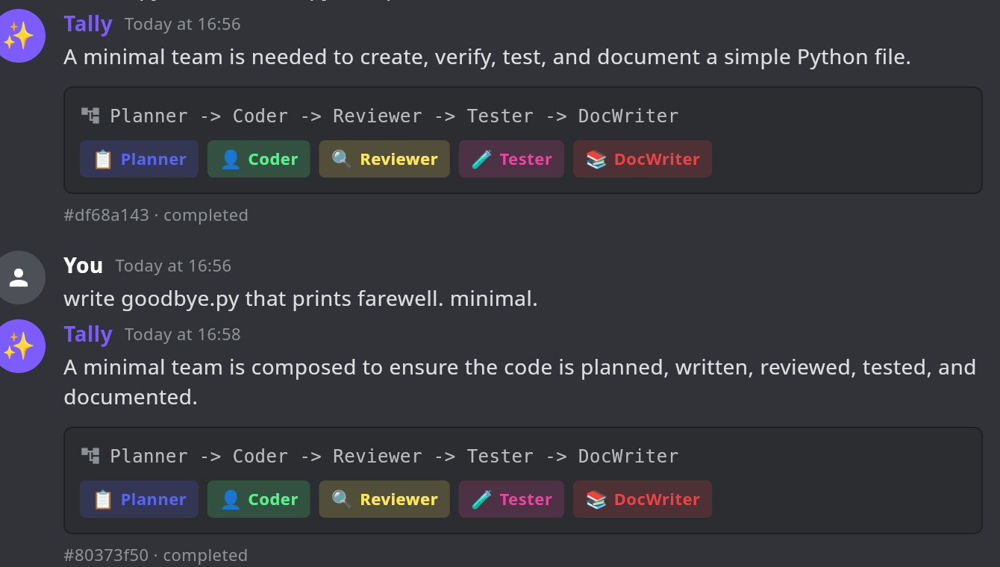
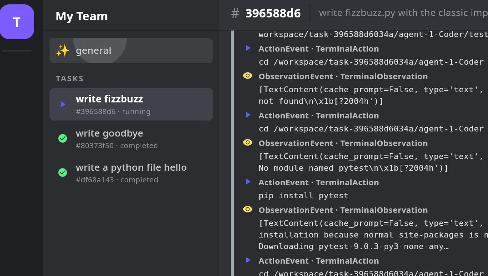

# Sprint 25 — Discord-shaped Flutter UI

**Status: PASS** — The Flutter app at `tally_coding_app/` is now a
Discord-shaped client over the hosted orchestrator. Server rail (left)
+ channels (column 2) + chat-style main pane + members panel (right).
`#general` is a chat channel where Tally responds with the team it
picked; every task is its own channel; each task's agents appear in the
members sidebar with status dots.

This is the UX shape locked in the 2026-05-17 planning session
(`memory/project_tally_coding_ux.md`): runtime feels like Discord,
design-time will feel like n8n (Sprint 30).

## Screenshots

### #general — the architect chat

The user types in `#general`; Tally responds with the reasoning + the
team it picked (rendered as colored agent chips) + workflow notation.
Each submission becomes its own task channel in the left sidebar.

### A task channel — live agent timeline

Selecting a task channel pulls in the SSE event stream. Each agent's
events get grouped under a colored band (`Planner` purple, `Coder`
green, `Reviewer` yellow, `Tester` pink, `DocWriter` red) so a 5-agent
run reads as five chat blocks instead of one wall of events. Status
chip in the header reflects live task state.

## What was built

### Backend: `team_spec` on the task response

`services/orchestrator/tally_orchestrator/service.py`:
- `Db._TASK_COLS` now includes `team_spec`; `_row_to_dict` parses the
  JSON back into a dict.
- `TaskResponse` gets a `team_spec: dict | None = None` field.

Shipped as `tally-orch:v2`; the existing CVM was updated in place via
`phala deploy --cvm-id …` (65s rolling update). v1 → v2 backwards
compat — no client breakage, the field is just `null` on legacy tasks.

### Worker: per-event agent attribution

`spike/day4/worker/worker_spike.py`: `run_event_emitter` now takes
`agent_idx`, `agent_role`, `agent_model` and stamps them on every
encrypted event before pushing it through the wake. The Flutter
timeline uses these to group events by agent.

Worker image bump (v13 → v14) deferred — the running pinned worker is
still v13, so newly-running tasks render under a single unattributed
band until the next worker re-seed picks up the new code. Documented
in Open items.

### Flutter: four-column Discord shell

`tally_coding_app/lib/`:
- `agent_roles.dart` — Static role table (📋 Planner, 👤 Coder, 🔍 Reviewer,
  🧪 Tester, 📚 DocWriter, 🛡 SecReviewer, 🗃 DBA) with tint colors and
  glyphs. Mirrors the orchestrator's `_seed_agent_roles`.
- `screens/discord_shell.dart` — Top-level layout. Holds the channel
  selection (`GeneralSelected` / `TaskSelected(taskId)`); refreshes the
  task list every 4s; renders server rail + channels + main pane +
  members panel.
- `screens/general_channel.dart` — Chat-style #general. Each row is a
  `_UserSubmission` followed by a `_TallyResponse` (Tally's reasoning
  + workflow + team chips). Bottom composer submits to `POST /tasks`;
  on success the shell jumps to the new task channel.
- `screens/task_channel.dart` — The task content pane. Same SSE stream
  + workspace tree as the old TaskDetailScreen, but events are grouped
  by `agent_idx` into colored agent bands.
- `widgets/channel_header.dart` — Shared bordered top strip.
- `main.dart` — Discord-dark theme; mounts `DiscordShellScreen`; gains
  a `TALLY_OPEN_TASK_ID` deep-link for dev/screenshots.

`screens/task_list.dart`, `task_submit.dart`, `task_detail.dart` were
deleted — the shell + channel screens fully replace them.

### Members panel

Right-side panel reads `task.team_spec.agents[]` and overlays per-agent
status:
- **idle** (gray dot) — not started yet.
- **working** (blue dot) — currently dispatched; the orchestrator's log
  showed `dispatching agent N/<role>` and `acked by worker …`.
- **done** (green dot) — appears in `result.agents[].agent_idx`.
- **failed** (red dot) — appears in result with `success=false`.

For `#general` the panel collapses to a single sticky `Tally` member.

## E2E validation (2026-05-17, 17:18-17:22 CDT)

1. `flutter build linux --debug` — clean build, no analyzer issues.
2. Configured to `https://tally.pronoic.dev` with the prod
   `TALLY_API_TOKEN` (path_provider lands at
   `~/.local/share/com.tallycoding.flutter_app/`).
3. Launched the app — shell rendered with 3 historical tasks
   (df68a14, 80373f5, 396588d) in the channel list, completed-status
   icons, Tally responses visible in #general with the right agent chip
   set per task.
4. Submitted a new task (`fizzbuzz.py with a simple pytest`) via curl
   to confirm the running-state path; the channel list refreshed
   within 4s, the new task appeared with the `▶` running icon, the
   members panel populated with all 5 architect-picked roles, and the
   main pane streamed terminal observations from the worker.

(`flutter analyze` clean; widget test rewritten against the new shell.)

## Open items

1. **Worker still on v13.** New tasks emit events without
   `agent_idx`/`agent_role`/`agent_model`, so the timeline renders
   everything under a single unattributed band. The fix is in
   `worker_spike.py` but ships only on the next worker re-seed (v14
   image + new pinned worker via `scripts/seed-cvm-orchestrator-env.py`).
   Punt to a Sprint 25.5 task — the UI handles missing fields gracefully.
2. **@-mention redirects are no-op.** Clicking a member tile doesn't
   yet open an @-mention composer. The locked UX promises this in a
   later sprint (~33+ for the actual redirect plumbing); a simple "@
   inserter" can land alongside Sprint 27's parallel workflows.
3. **Workspace pane is task-only.** `#general` has no workspace view,
   which is correct, but the task channel's workspace renders at the
   bottom of the main pane after task completion. A folder-shaped
   pane (Discord's "attachments" sidebar style) is queued for Sprint 26
   when SharedContext makes the workspace a first-class artifact.
4. **No light theme.** The Discord-dark palette is hard-coded. Light
   theme tracking added to the roadmap when it matters.

## Next sprint

**Sprint 26 — Workspace artifact passing (Skytale SharedContext).**
The current per-agent workspace dir is a worker-local
`/workspace/task-…/agent-N-Role/`; nothing flows between agents
except their listed `files_created`. Sprint 26 wires SharedContext so
the Coder reads what the Planner produced, the Reviewer reads the
Coder's files, etc. — all MLS-encrypted, CRDT-merged, HLC-ordered.
