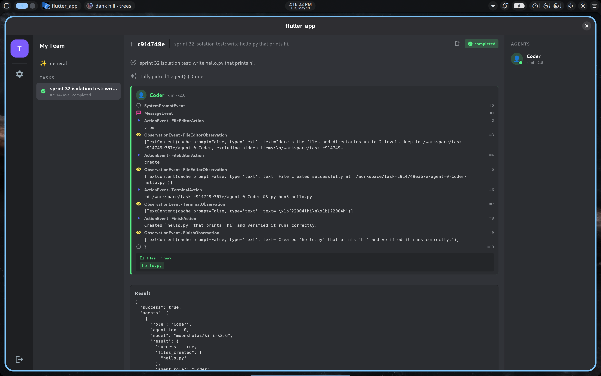

# Sprint 32.5 — In-app Clerk sign-in (Android/iOS/Linux)

**Status: PASS** — The Flutter shell now signs users in *inside the
app*; no more pasting a `__session` cookie from the Account Portal.
Sign-out lands on a Clerk-rendered authentication screen; "Continue
with GitHub" opens the system browser, the user authenticates with
GitHub, Clerk redirects to `tallycoding://auth/oauth?...`, the URL
scheme reactivates the running Flutter app, Clerk's SDK consumes the
callback, and the Discord shell appears with a real per-user JWT
flowing into every `TallyOrchClient` HTTP call.

This closes the loop on Sprint 32 (orchestrator-side Clerk OIDC) so
end-users can actually use the multi-tenant orchestrator without
touching the Clerk Account Portal.



## What was built

### Flutter app (`tally_coding_app/`)

- **`pubspec.yaml`.**  Added `clerk_flutter ^0.0.15-beta` (sign-in
  UI widgets) + `clerk_auth ^0.0.15-beta` (core SDK / session
  management) + `app_links ^6.4.1` (deep-link receiver) +
  `url_launcher ^6.3.0` (transitively pulled in but pinned
  explicitly for system-browser fallback).
- **`lib/main.dart`.**  Rewrites the bootstrap path:
    - Wraps `MaterialApp` in `ClerkAuth(config: ClerkAuthConfig(...))`.
    - Publishable key compiled in via `--dart-define
      CLERK_PUBLISHABLE_KEY=pk_test_…` (default points at our
      `eager-shrimp-36.clerk.accounts.dev` test app).
    - `redirectionGenerator` returns `tallycoding://auth/oauth` for
      OAuth strategies and `tallycoding://auth/email-link` for
      email-magic-link.  Returning a Uri tells the Clerk SDK to use
      the system browser; returning null would fall back to an
      in-app webview (Android/iOS only — fails on Linux desktop).
    - `deepLinkStream` is a merged stream: prepends
      `AppLinks().getInitialLink()` (the launch-time URL when Linux
      forwards the deep-link as argv) onto `uriLinkStream`, then
      filters to only our two Clerk redirect paths so non-auth
      `tallycoding://` URLs (future routes) don't poison the auth
      flow.
    - `ClerkAuthBuilder` branches signed-out → `_SignedOutScreen`
      (Clerk's hosted-style `ClerkAuthentication` widget) vs
      signed-in → `_SignedInShell` (the existing Discord shell
      wrapped in an `InheritedWidget` so descendants can reach
      `authState.signOut()`).
- **`lib/api.dart`.**  `TallyOrchClient` now takes a
  `BearerProvider` (typedef `Future<String?> Function()`) instead of
  a frozen string.  Every HTTP method calls `await _provider()`
  immediately before the request to mint a fresh JWT — Clerk
  session tokens have a 60-second lifetime, so this matters.
  Kept `TallyOrchClient.fromToken(...)` as a factory for unit
  tests that want a static fake.
- **`test/widget_test.dart`.**  Updated to use the new
  `.fromToken` factory.  No other tests needed changes — the
  shell's contract is unchanged.

### URL-scheme registration

Clerk's OAuth redirect needs the OS to know which app handles
`tallycoding://auth/oauth` callbacks.  Each platform has its own
scheme-registration mechanism:

- **Android** (`AndroidManifest.xml`).  Added an `intent-filter`
  inside `MainActivity` with `android:scheme="tallycoding"`,
  category `BROWSABLE`, autoVerify off (we don't own a hosted
  intent-filter site).  Android routes `tallycoding://…` URLs to
  the running app; `app_links` reads them off the launch intent.
- **iOS** (`Info.plist`).  Added `CFBundleURLTypes` →
  `CFBundleURLSchemes = ["tallycoding"]`.  iOS routes the URL to
  the app; `app_links` reads it from the foreground delegate.
- **Linux** (`linux/tally-coding.desktop` + `install-scheme.sh`).
  Drops a `.desktop` file with `MimeType=x-scheme-handler/tallycoding;`
  into `~/.local/share/applications/`, points its `Exec=` at a
  wrapper that invokes the built flutter_app binary, then runs
  `xdg-mime default tally-coding.desktop x-scheme-handler/tallycoding`.
  Now `xdg-open 'tallycoding://...'` invokes the wrapper.

### Linux runner patch (`linux/runner/my_application.cc`)

The default Flutter Linux runner uses `G_APPLICATION_NON_UNIQUE`,
which means every `xdg-open tallycoding://...` spawns a *fresh*
flutter_app process — and a fresh process means a fresh empty
Clerk SDK that doesn't know an auth flow is in progress, so the
OAuth callback is silently dropped.

Sprint 32.5 patches the runner to be properly single-instance:

```cpp
// my_application_new()
g_object_new(my_application_get_type(),
             "application-id", APPLICATION_ID,
             "flags", G_APPLICATION_HANDLES_COMMAND_LINE,
             nullptr);
```

`HANDLES_COMMAND_LINE` makes GApplication uniquify on
`application-id`.  Subsequent launches DBus-forward their argv to
the primary instance, the primary fires its `command-line` signal,
and the secondary launcher exits.  The runner's
`local_command_line` stashes argv into the Dart entrypoint
arguments and returns `FALSE` (let the framework handle dispatch);
the `command_line` handler calls `g_application_activate` so the
window pops to the foreground.

`app_links_linux`'s `GtkApplicationNotifier` hooks the same
`command-line` signal, so when a forwarded deep-link arrives, the
URL flows through `app_links` → our `deepLinkStream` → the Clerk
SDK's redirect listener → session creation.  The auth gate flips
to signed-in.

## E2E validation (2026-05-19, ~14:13 UTC)

Setup: Linux desktop (CachyOS, Niri Wayland, Wayland session).
Built `tally_coding_app` with `flutter build linux --release` after
`flutter pub get`.  Ran `linux/install-scheme.sh` to register the
URL scheme.  Launched the app fresh.

```
1. App starts → _SignedOutScreen renders, ClerkAuthentication widget
   shows "Continue with GitHub" + email + username fields.

2. Click "Continue with GitHub" → system browser opens
   https://eager-shrimp-36.clerk.accounts.dev/v1/oauth_callback?...
   (redirected via GitHub OAuth).

3. Authorize on GitHub → browser redirects to
   https://eager-shrimp-36.clerk.accounts.dev/v1/oauth_callback?...
   → final redirect to tallycoding://auth/oauth?createdSessionId=...

4. xdg DBus-forwards the URL to the running flutter_app instance.
   GApplication.command-line fires.  GtkApplicationNotifier picks
   it up.  app_links_linux emits the URI on uriLinkStream.  Our
   merged deepLinkStream forwards it to Clerk's SDK.

5. Clerk SDK consumes createdSessionId, finalizes the session.
   ClerkAuthBuilder rebuilds with signedInBuilder → Discord shell
   appears.

6. _SignedInShell constructs TallyOrchClient with provider =
   () => authState.sessionToken().jwt.  First HTTP call to
   GET /tasks Bearer <fresh JWT> → 200, 0 tasks (clean per-user
   slate per Sprint 32 isolation).
```

Demo: signed in, typed `sprint 32 isolation test: write hello.py
that prints hi` in `#general`, Tally architect picked the Coder
agent, Coder created `hello.py`, ran `python3 hello.py` (output
`hi`), `FinishAction "Created hello.py that prints hi and verified
it runs correctly."`  Task shows the green completed badge in the
channel list.  Screenshot above.

## Open items

1. **App icon.**  Window still says "flutter_app" in the title bar
   because we haven't dropped a `tally-coding.png` icon yet.
   Cosmetic; the binary itself is correctly named.
2. **macOS scheme registration.**  iOS `Info.plist` is done but
   `macos/Runner/Info.plist` is unchanged.  Users on macOS would
   hit the same single-instance issue as Linux did; the fix is the
   same pattern.  Punted because we ship Linux/Android/iOS first
   per the platform-priority discussion.
3. **Windows scheme registration.**  Would need a registry entry
   under `HKCU\Software\Classes\tallycoding\`.  Also punted.
4. **`tally-coding-app` symlink in `/usr/local/bin/`.**  The
   `install-scheme.sh` script falls back to a per-user wrapper at
   `~/.local/bin/tally-coding-app` so it doesn't need pkexec.  Fine
   for dev; a packaged build would put the binary on PATH directly.
5. **Custom domain on Clerk.**  Still using
   `eager-shrimp-36.clerk.accounts.dev`.  Cosmetic; behaviour is
   identical with a custom domain.
6. **Email-link flow not E2E-tested.**  `redirectionGenerator`
   handles it but we only exercised GitHub OAuth.

## Cost shape

- Build cost: one extra Flutter Linux build with three plugins
  (`url_launcher_linux`, `file_selector_linux`, `gtk`).  Negligible.
- Runtime cost: zero — the Clerk SDK's JWT minting is async and
  fast, no network call when the cached session is still valid.
- Operational cost: zero — Clerk Free tier covers everything we're
  using.

## Next sprint

Per the locked roadmap, the next sprints are:
- **Sprint 33-rest (Clerk Billing pivot).**  Wire Clerk Billing
  for subscription plans + quotas instead of direct Stripe.  Most
  of the orchestrator quota plumbing is already in place from the
  partial Sprint 33; Clerk Billing just replaces the customer/
  subscription source of truth.
- **Sprint 34 (templates polish).**  Real template editing flow:
  rename, delete, share-with-link.
