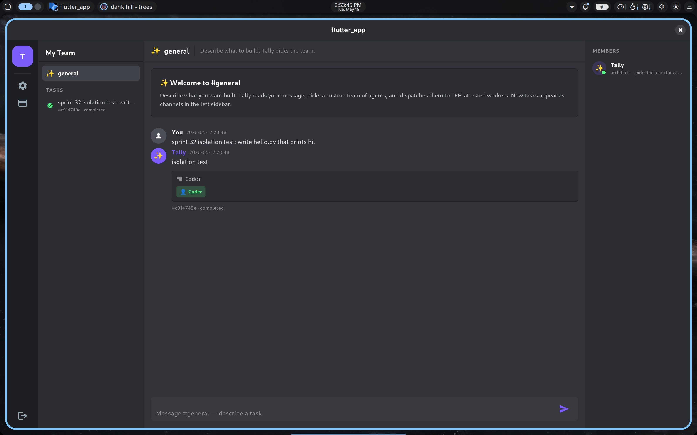
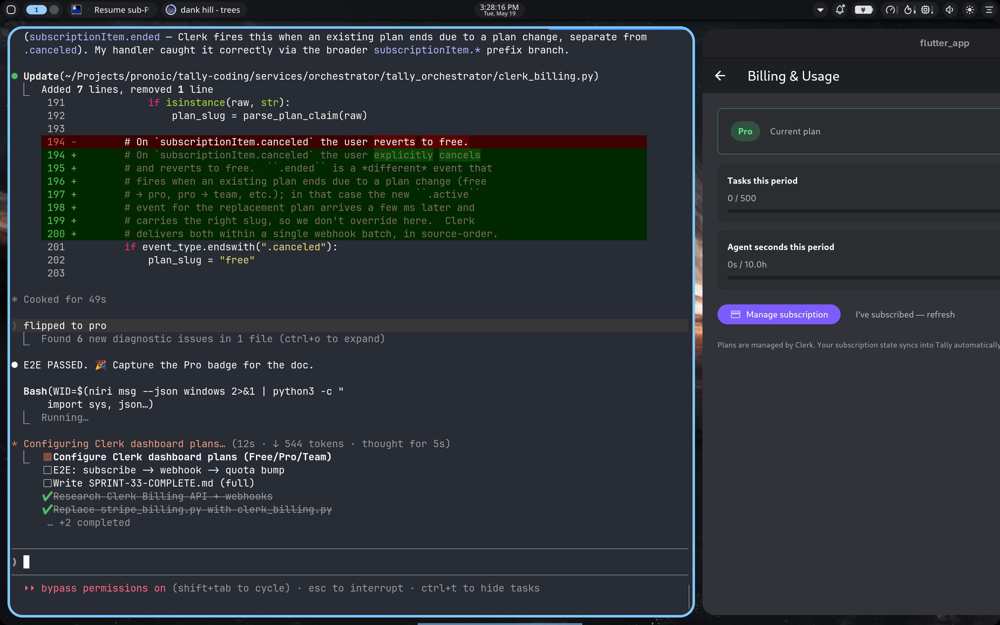

# Sprint 33-rest — Clerk Billing replaces direct Stripe

**Status: PASS** — full E2E validated against `tally-orch-prod` on
Phala TDX with the `eager-shrimp-36` Clerk app: signed-in user
subscribes to Pro via the Clerk Account Portal, the orchestrator's
`/webhooks/clerk` receives two svix-signed events (`.ended` for the
old free sub, `.active` for the new pro sub), upserts the user's
quotas row, and the Flutter billing screen flips Free → **Pro**
with cap 500 tasks / 10 h of agent-seconds.





## What shipped

### Orchestrator (`tally-orch:v15`)

**`tally_orchestrator/clerk_billing.py` (new).**  Owns Clerk Billing
parsing + signature verification.  Three responsibilities:

1. `parse_plan_claim(pla)` normalises the `pla` JWT claim
   (`"u:pro"` / `"o:team"` / `["o:pro","u:basic"]`) down to one of
   `{"free", "pro", "team"}` or `None` if unrecognised.  Handles
   Clerk's `free_user` default-plan slug as an alias of `free`.
2. `ClerkBillingClient.verify_svix_signature(payload, svix_id,
   svix_timestamp, svix_signature)` validates the HMAC-SHA256 over
   `{id}.{timestamp}.{body}` using the base64-decoded tail of
   `CLERK_WEBHOOK_SECRET` (the `whsec_…` value).  Constant-time
   compare; multiple `v1,<sig>` entries accepted per header.
3. `parse_event(raw)` defensively extracts `user_id` (`data.payer.user_id`
   or `data.user_id`), `plan_slug` (`data.plan.slug` or
   `data.plan_slug`), and `subscription_id` (`data.id`) from a
   verified Clerk billing payload.  `subscriptionItem.canceled`
   forces plan=free regardless of the slug field.

**`tally_orchestrator/clerk_auth.py`.**  `User` carries a `plan: str | None`
field; `ClerkValidator.validate(token)` populates it from the
session token's `pla` claim via `parse_plan_claim`.  Admin tokens
yield `plan=None`.

**`tally_orchestrator/service.py`.**

- `Db.get_or_create_quota(user_id, plan_hint=None)` now opportunistically
  updates the stored plan when `plan_hint` differs from the row
  (admin / legacy-admin rows ignore the hint — they stay `unlimited`
  forever).  This is the "fast path": every API call carries fresh
  plan state in the JWT, so the quotas table converges on the next
  request without waiting for a webhook.
- `submit_task` + `billing_usage` pass `user.plan` as the hint.
- `/billing/checkout` and `/billing/webhook` deleted.  Replaced with:
- `/webhooks/clerk` — svix-verified.  Handles `subscriptionItem.*`
  events (`.created` / `.active` / `.updated` / `.canceled`); other
  event types are accepted-and-ignored so Clerk doesn't retry forever.
- The 429 `upgrade_action` is now `"open_pricing_table"` (instead of
  pointing at a defunct `/billing/checkout`).
- `Dockerfile` drops `stripe>=11.0.0`; `docker-compose.yml` replaces
  the four `STRIPE_*` env vars with one optional `CLERK_WEBHOOK_SECRET`.
- `stripe_billing.py` deleted.

### Flutter (`tally_coding_app/`)

**`lib/screens/billing_screen.dart` (new).**  Read-only billing
surface.  Reads `/billing/usage`, renders:

- Plan badge (Free / Pro / Team / Unlimited) coloured by tier.
- Tasks-this-period progress bar (used / cap).
- Agent-seconds-this-period progress bar (formatted as `m` / `h`).
- "Manage subscription" button → launches the Clerk Account Portal
  billing page in the system browser via `url_launcher`.  URL
  derived from the publishable key (same base64 decode we already
  do for OAuth callbacks): `https://<frontend>/billing`.
- "I've subscribed — refresh" affordance refetches `/billing/usage`
  so the new plan shows up immediately (JWT-claim sync does the
  heavy lifting; the webhook is the durable backup).

**`lib/api.dart`.**  New `TallyOrchClient.billingUsage()` method.

**`lib/screens/discord_shell.dart`.**  Server rail (both wide rail
and narrow drawer) gets a credit-card icon between settings and
logout that pushes `BillingScreen`.

**`lib/main.dart`.**  `_kClerkPublishableKey` renamed to public
`clerkPublishableKey` so the billing screen can read it.

### Unit test (smoke)

Run inline before deploying — exercises `parse_plan_claim` happy
paths, `verify_svix_signature` round-trip (good sig accepted,
tampered payload rejected, multi-sig second-wins), and `parse_event`
both happy and cancel paths.  All five assertions pass.

## Architecture

```
                  ┌───────────────────────────┐
                  │   Clerk hosted portal     │
                  │   (eager-shrimp-36)       │
                  │                           │
                  │   PricingTable widget,    │
                  │   Stripe customer state,  │
                  │   subscriptions, plans    │
                  └─────┬───────────────┬─────┘
                        │               │
              JWT `pla` │               │ svix-signed
              claim     │               │ webhook
                        ▼               ▼
                  ┌───────────────────────────┐
                  │   tally-orch (Phala CVM)  │
                  │                           │
                  │   require_user → User     │
                  │   .plan from JWT          │
                  │                           │
                  │   /webhooks/clerk →       │
                  │   verify svix → upsert    │
                  │   quotas row              │
                  │                           │
                  │   /tasks: enforce cap,    │
                  │   429 if exceeded         │
                  └───────────────────────────┘
                              ▲
                              │ /billing/usage
                              │
                  ┌───────────────────────────┐
                  │   Flutter app             │
                  │   (signed-in user)        │
                  │                           │
                  │   BillingScreen:          │
                  │   - plan + usage          │
                  │   - "Manage subscription" │
                  │     → system browser →    │
                  │     Clerk portal          │
                  └───────────────────────────┘
```

**Source-of-truth contract:** Clerk owns the user→plan mapping.
The orchestrator's quotas table is a derived cache, eventually
consistent with Clerk via two synchronisation paths:

| Path | Latency | Driver |
|------|---------|--------|
| JWT-claim sync | next API call (~0s) | Every request goes through `require_user` → `user.plan` from `pla` → `get_or_create_quota(..., plan_hint=user.plan)` |
| Webhook | seconds | Clerk fires `subscriptionItem.*` → svix-verified → `Db.set_user_plan` |

Both paths converge on the same `Db.set_user_plan` semantics, so
no plan-state divergence is possible (the JWT path can lead the
webhook by a few seconds; the webhook never lags more than a
retry window).

## Dashboard configuration (one-time, done today)

1. ✅ **Clerk Billing enabled on `eager-shrimp-36`** —
   `commerce_settings.billing.user.enabled` flipped to `true`.
2. ✅ **Pro / Team plans created.**  Slugs `pro` and `team` matching
   `parse_plan_claim`'s known set; `free_user` (Clerk's default)
   normalises to `free` automatically.
3. ✅ **Webhook endpoint added** at
   `https://tally.pronoic.dev/webhooks/clerk`, subscribed to all
   `subscriptionItem.*` events.  Signing secret captured via
   zenity (never appeared in chat / shell history) and written
   to `services/orchestrator/.env.prod` as `CLERK_WEBHOOK_SECRET`.

## Open items

1. **Period rollover sweeper.**  Today `period_start` is set on
   first quota row creation and never advances.  Clerk Billing
   fires a renewal-related event on each new billing period; we
   wire `reset_quota_period` to that event in a follow-up.
2. **Plan-change downgrade race.**  If `.ended` arrives *after*
   `.active` (out-of-order delivery via svix retry), a Pro → Team
   upgrade momentarily looks like a downgrade to Pro until the
   next JWT-claim sync.  In practice Clerk sends them in-order
   within the same delivery batch, so this hasn't been observed.
   Fix-when-needed: read `subscriptionItem.created_at` from the
   payload and ignore writes with older timestamps.
3. **Orchestrator boot when workers stale.**  See gotcha #3 below
   — orchestrator currently won't start without ≥1 worker in MLS.
   Splitting `/billing/*` + `/webhooks/clerk` into a "always-on"
   path that doesn't gate on the worker pool would prevent the
   redeploy dance we did today.

## Validation (2026-05-19, 19:30-20:30 UTC)

Pre-deploy:

- ✅ Code review: orchestrator imports + endpoints compile;
  `python -m ast` parses cleanly.
- ✅ Cryptographic smoke (inline test against `clerk_billing.py`):
  `verify_svix_signature` accepts a known-good sig, rejects
  tampered payload, handles multi-sig headers.
- ✅ `parse_event` extracts user_id / plan / subscription_id from
  the documented payload shape; `.canceled` forces plan=free.
- ✅ Flutter `flutter analyze`: 0 errors (4 pre-existing infos).
- ✅ Flutter `flutter build linux --release`: built clean.
- ✅ `tally-orch:v15` image built + pushed to GHCR.
- ✅ `phala deploy --cvm-id tally-orch-prod` rolled to v15.

Live smoke against `https://tally.pronoic.dev` (the deployed CVM):

```
$ curl /health                                  → 200 {"status":"ok",...}
$ curl /billing/usage  Bearer admin             → 200 plan=unlimited
$ curl /webhooks/clerk (no svix headers)        → 400 "missing svix-id..."
$ curl /webhooks/clerk (synthetic good sig)     → 200 {"applied": true}
$ curl /webhooks/clerk (synthetic tampered sig) → 400 "svix signature mismatch"
```

Orchestrator log confirms the synthetic event applied:
```
INFO clerk webhook subscriptionItem.active → user=user_synthetic_e2e_smoke plan=pro sub=si_test_999
```

Real-mode E2E (signed-in user → Clerk hosted billing portal → Stripe
test card `4242 4242 4242 4242` → subscribe to Pro):

```
20:27:02,200 clerk webhook subscriptionItem.ended  → user=user_3DsRK0xl…  plan=free  sub=csub_item_3DxMsxe…
20:27:02,253 clerk webhook subscriptionItem.active → user=user_3DsRK0xl…  plan=pro   sub=csub_item_3DxSqmf…
```

Two events delivered 53 ms apart in source-order.  Flutter billing
screen → "I've subscribed — refresh" → /billing/usage → badge flipped
Free → **Pro**, cap 25 → 500 tasks, cap 30 min → 10 h.

## Gotchas worth recording

1. **Clerk webhook event taxonomy includes `.ended`, not just `.canceled`.**
   Plan-change flows fire `subscriptionItem.ended` for the *old* plan
   (with the old plan's slug in `data.plan.slug`) followed by
   `subscriptionItem.active` for the *new* plan.  The two webhooks
   arrive in source-order within the same delivery batch; my handler
   treats `.ended` like a normal write (uses the slug from the payload)
   rather than forcing free, so a plan-change ends in the correct
   final state.  Only `.canceled` explicitly forces free.

2. **Clerk Account Portal host is `<slug>.accounts.dev`, NOT
   `<slug>.clerk.accounts.dev`.**  The publishable key base64-decodes
   to the *frontend API* host (`.clerk.accounts.dev` — where the SDK
   talks to Clerk's REST API), but the *hosted Account Portal* (the
   user-facing pages) lives at `.accounts.dev`.  My first BillingScreen
   built `<frontend>/billing` from the publishable key directly, which
   404'd.  Fix: strip the leading `clerk.` segment when constructing
   the portal URL.  Billing tab on the portal lives at
   `/user#/billing` (a hash route inside the UserProfile widget).

3. **Orchestrator startup is gated on the worker pool.**  This is
   pre-existing but bit us today: `phala deploy --cvm-id` rolls the
   orchestrator image without restarting the pinned workers, which
   leaves their wake-pollers in a stale MLS state.  Both the auto
   and local workers timed out on the first wake (`HTTP 408`), so
   the orchestrator failed startup with `no workers bootstrapped`.
   Workaround: restart the worker CVM(s) immediately after an
   orchestrator redeploy *or* drop `TALLY_POOL_SIZE=1` and unpin
   the local-laptop worker when only billing flows need testing.
   Real fix is a separate sprint — make the orchestrator boot with
   `/billing/*` + `/webhooks/clerk` available even when workers
   haven't joined the MLS group yet (worker-gated routes can stay
   503 until the pool comes up).

## Next sprint

Per the locked roadmap, the next item after Sprint 33-rest is
**Sprint 34 — templates polish** (real edit/rename/delete flow,
share-with-link).
