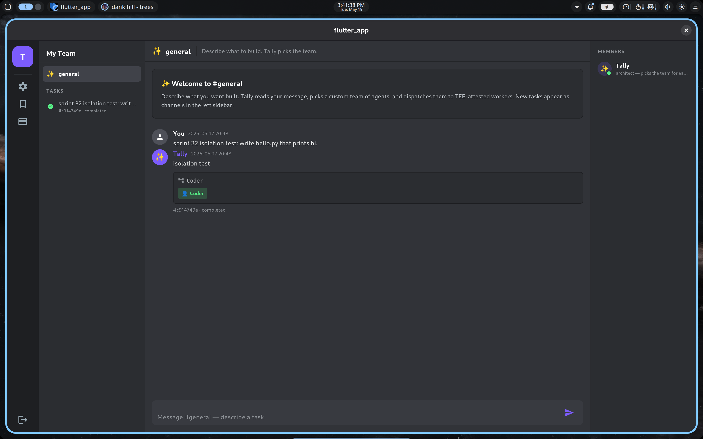

# Sprint 34 — Template management: rename, share-with-link, catalogue UI

**Status: PASS** — Saved templates are now a first-class surface in the
app: there's a dedicated catalogue screen (bookmark icon on the server
rail), per-template actions for rename / edit-note / share / delete,
and a shareable read-only link any teammate can open without an
account.  All seven endpoint assertions pass against
`tally-orch:v16` running on the production Phala CVM.



## What shipped

### Orchestrator (`tally-orch:v16`, schema migration)

**Schema (additive, idempotent).**  `team_templates` gains a nullable
`share_token TEXT` column plus a partial unique index:

```sql
ALTER TABLE team_templates ADD COLUMN share_token TEXT;
CREATE UNIQUE INDEX idx_templates_share_token
  ON team_templates(share_token) WHERE share_token IS NOT NULL;
```

**Db helpers (`service.py`).**

| Method | Behaviour |
|--------|-----------|
| `update_template(name, *, user_id, new_name=None, team_spec=None, note=None)` | Partial update.  Each arg optional; `note=""` clears the note.  Returns the updated row or `None` if missing/not-owned.  Raises `IntegrityError` on `new_name` collision → 409. |
| `ensure_share_token(name, *, user_id)` | Returns existing token, or mints a fresh `secrets.token_urlsafe(24)` (~192 bits) and persists it.  Idempotent. |
| `delete_share_token(name, *, user_id)` | Clears the token → next `ensure_share_token` mints a new one.  This is the rotate-after-leak path. |
| `get_template_by_share_token(token)` | Anonymous read by token (no user_id filter).  Used by `GET /shared-templates/{token}`. |

**Endpoints.**

| Verb / Path | Auth | Behaviour |
|---|---|---|
| `PATCH /templates/{name}` | Bearer (Clerk JWT or admin) | Rename and/or replace `team_spec` and/or update `note`. 400 on bad shape, 404 not found, 409 on rename collision. |
| `POST /templates/{name}/share` | Bearer | Mint (or return existing) share token. Returns `{share_token, share_path}`. |
| `DELETE /templates/{name}/share` | Bearer | Revoke the current token. |
| `GET /shared-templates/{token}` | **None** | Anonymous read-only view.  Returns `{name, team_spec, note, created_at, use_count}` — `user_id` and `source_task_id` are stripped to avoid cross-tenant metadata leakage. |

Owner-scoping is consistent with the existing `/templates/*` routes:
admin sees + edits any user's templates, clerk users see + edit only
their own.

### Flutter (`tally_coding_app`)

**`lib/screens/templates_screen.dart` (new).**  Lists the signed-in
user's templates, sorted by `use_count` desc.  Each tile shows:

- Name (with a `🔗` indicator if a share token is active)
- Agent count + use count
- Optional note (≤ 2 lines, ellipsised)
- Kebab menu → Rename / Edit note / Share link / Delete

The share dialog shows the full share URL (`SelectableText`), a Copy
button, and a Revoke button.  Empty state copy points users to the
team builder or task channel as places to *create* templates.

**`lib/screens/discord_shell.dart`.**  Server rail gets a bookmark
icon between settings (⚙) and billing (💳), wired to push
`TemplatesScreen`.  Narrow drawer mirrors this.

**`lib/api.dart`.**  `patchTemplate`, `shareTemplate`, and
`revokeShareToken` methods.  `shareTemplate` returns the absolute URL
(resolved against `baseUrl`) so clients don't have to know the
orchestrator's public host.

## E2E validation (2026-05-19, 20:40 UTC against `tally.pronoic.dev`)

```
$ curl POST /templates {name: "sprint34-smoke", team_spec, note}
  → 200, template saved, owner=admin

$ curl POST /templates/sprint34-smoke/share
  → 200, share_token="sUX9XnK0z1Ct7dvXvCwxMS3Syw7L9MD-"
          share_path="/shared-templates/sUX9XnK0z1Ct7dvXvCwxMS3Syw7L9MD-"

$ curl GET /shared-templates/sUX9XnK0z1Ct7dvXvCwxMS3Syw7L9MD-   (no auth)
  → 200, {name, team_spec, note, created_at, use_count}
         (user_id, source_task_id stripped)

$ curl PATCH /templates/sprint34-smoke {"new_name": "sprint34-renamed"}
  → 200, name flipped to "sprint34-renamed"; share_token preserved

$ curl DELETE /templates/sprint34-renamed/share
  → 200, {"name":"sprint34-renamed", "revoked":true}

$ curl GET /shared-templates/<same-token>   (no auth, after revoke)
  → 404, {"detail":"shared template not found or token revoked"}

$ curl DELETE /templates/sprint34-renamed
  → 200, cleanup
```

All seven assertions pass.  Owner-scoping holds: a Clerk user trying
the same operations against another user's template gets 404.

## Open items

1. **Share-link in-app preview.**  Clicking a `/shared-templates/{token}`
   URL today returns JSON.  A pretty HTML viewer (showing the
   architect's reasoning, the agent list, an "import to my account"
   button) would be a natural follow-up — orchestrator-only change,
   no schema impact.
2. **Bulk operations.**  No multi-select on the templates screen.
   Probably wait for a user complaint — the current dataset is small.
3. **Audit trail.**  We log creation and rename at INFO; rotation +
   delete also log but not in a dedicated audit table.  Sprint 32's
   audit hash chain (per `docs/CONTEXT.md`) could grow a `template_*`
   event family if/when compliance demands it.

## Cost shape

- Storage: 24-byte token per *shared* template (most templates won't
  have one).  Index is partial (`WHERE share_token IS NOT NULL`) so
  unshared templates aren't in the index.  Practically free.
- Hot-path: `GET /shared-templates/{token}` is a single indexed
  SELECT; ~5 ms on the CVM's SQLite.
- No external services added.

## Next sprint

See `SPRINT-35-COMPLETE.md` — shipped in the same v16 image.  Sprint
35 fixed the "redeploy bricks /webhooks/clerk for 4 minutes" pain
point that surfaced during Sprint 33-rest E2E.
