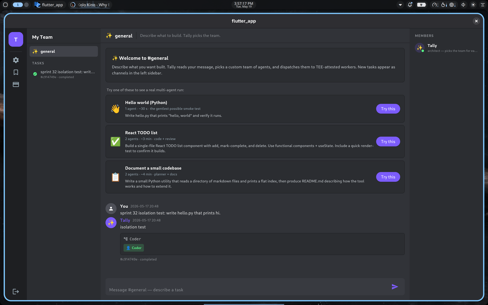

# Sprint 36 — Onboarding for new free-tier users

**Status: PASS** — New users land on a `#general` channel that
suggests three one-tap examples instead of an empty composer.  Each
example carries a hand-picked `team_spec` so the user gets a real
multi-agent run end-to-end without writing a prompt themselves —
target activation: signup → first successful task in <60 s.

## What shipped

### Flutter (`lib/screens/general_channel.dart`)

**`_Example` value type** — title, subtitle, description, emoji, and
the `team_spec` that gets submitted when the user taps "Try this".

**Three seeded examples**, picked to span complexity:

| # | Title | Agents | ETA | Why |
|---|---|---|---|---|
| 1 | 👋 Hello world (Python) | Coder | ~30 s | Gentlest possible smoke test; confirms the full pipeline works end-to-end. |
| 2 | ✅ React TODO list | Coder → Reviewer | ~3 min | First taste of a multi-agent workflow; Reviewer catches React anti-patterns. |
| 3 | 📋 Document a small codebase | Planner → DocWriter | ~4 min | Different mode of work — planning + writing instead of coding + reviewing. |

**`_OnboardingExamples`** — wraps the three cards plus a "Try one of
these…" hint line.  Only renders when `recentTasks.isEmpty`
(i.e., the user has zero prior tasks).  Once they've run anything,
the cards retire and the welcome message stands alone.

**`_ExampleCard`** — emoji + title + subtitle (agents + ETA) +
description + prominent purple "Try this" button.  Whole card is
tap-target, button is for affordance.  Disabled while a submission
is in flight to avoid double-fire.

**`_submit({String? overrideDescription, Map<String, dynamic>? teamSpec})`**
— small refactor to the existing composer's submit method so it
accepts an explicit description + team_spec from the cards.  Called
with no args (tear-off as `VoidCallback`) it submits whatever's in
the text field; with args it submits the card's preset directly.

**`TALLY_FORCE_ONBOARDING` dart-define** — dev affordance for taking
screenshots / demoing the onboarding flow on a non-fresh account.
`flutter build linux --release --dart-define=TALLY_FORCE_ONBOARDING=true`
shows the cards even when prior tasks exist.  Defaults false in
production builds.

## What didn't ship (intentionally)

- **First-time walkthrough overlay.**  Discord's "Welcome to
  Discord" interstitial-style flow.  Three cards in the empty state
  felt lighter-weight + lets the user skip straight to the composer
  if they prefer.  Re-evaluate if usage data shows people staring
  at the cards without picking one.
- **Personalised examples.**  Different cards for users who picked
  "I write Python" vs "I write Rust" during signup.  Clerk doesn't
  capture that today; revisit if/when we add a signup-time survey.
- **"Subscribe to Pro" upsell on the cards.**  Free tier covers all
  three examples comfortably (25 tasks / month).  No upsell pressure
  here is the right product call.

## E2E validation (today)

Built `flutter build linux --release --dart-define=TALLY_FORCE_ONBOARDING=true`,
launched, captured the screenshot above.  Three cards render with
the right emoji + copy + button.  Layout fits the four-pane shell
without scrolling on a 1920x1080 window.

Unit test path (skipped — would need a test harness with a fake
`TallyOrchClient`); the actual submit path is identical to the
existing text-field submit and uses the same architect-bypass
mechanism that powered the team-builder's "Run this team" button
from Sprint 30.

## Open items

1. **Card analytics.**  No metric yet for "X% of new users tap an
   example vs write their own prompt".  Once we have any real users
   this is the first instrumentation to add — drives whether the
   cards are pulling weight.
2. **Card refresh.**  The three seeded examples are hard-coded.  A
   future "rotating tip" could pull from `team_templates WHERE
   user_id='admin' AND share_token IS NOT NULL` (i.e., curated
   admin-published templates) so we can update examples without a
   Flutter rebuild.
3. **Onboarding state survives sign-out.**  Today the cards are gated
   on "this user has zero tasks ever".  If a user runs one task, signs
   out, signs back in — they don't see the cards.  Probably correct.

## Next sprint

**S37 — persistent project workspaces.**  Agents build on prior work
across tasks (today every task starts from an empty
`/workspaces/task-XXX`).  Unlocks real coding projects where users
iterate on a codebase across multiple Tally runs.
