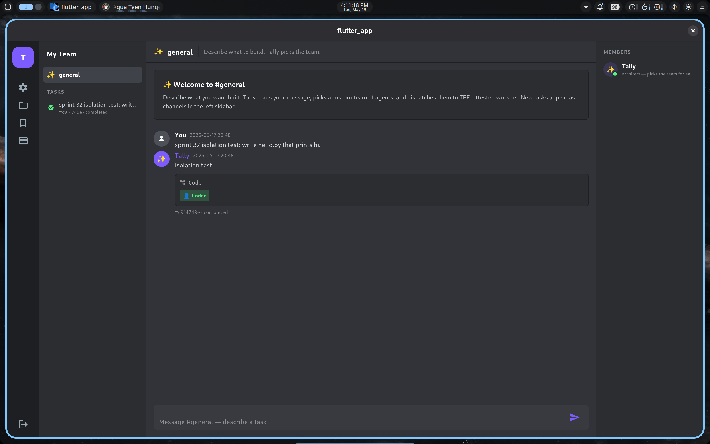

# Sprint 37 — Persistent project workspaces

**Status: PASS** — Agents now build on prior work across tasks.  A
task submitted with a `project_id` inherits the project's HEAD
artifact set as its first agent's seed_files, and on success its
final artifacts merge back into HEAD (last-writer-wins per path).
Validated end-to-end against the live CVM: task A writes
`hello.py`, task B in the same project reads + modifies it, and
HEAD reflects the modified file with `updated_at` advancing.



## What shipped

### Orchestrator (`tally-orch:v18`)

**Schema (additive, idempotent).**

```sql
CREATE TABLE IF NOT EXISTS projects (
    id          TEXT PRIMARY KEY,
    user_id     TEXT NOT NULL,
    name        TEXT NOT NULL,
    description TEXT,
    created_at  REAL NOT NULL,
    updated_at  REAL NOT NULL
);
CREATE INDEX idx_projects_user ON projects(user_id, updated_at DESC);

CREATE TABLE IF NOT EXISTS project_artifacts (
    project_id  TEXT NOT NULL,
    path        TEXT NOT NULL,
    b64_content TEXT NOT NULL,
    ts          REAL NOT NULL,
    PRIMARY KEY (project_id, path),
    FOREIGN KEY (project_id) REFERENCES projects(id)
);
CREATE INDEX idx_project_artifacts ON project_artifacts(project_id);

ALTER TABLE tasks ADD COLUMN project_id TEXT;
CREATE INDEX idx_tasks_project ON tasks(project_id, created_at DESC);
```

**Db helpers.**

| Method | Behaviour |
|--------|-----------|
| `create_project(user_id, name, description)` | Insert, returns generated `proj_<base64>` id. |
| `list_projects(user_id=...)` | Owner-scoped (or all for admin); each row carries `file_count`. |
| `get_project(id, user_id=...)` | Fetch one with `file_count`. |
| `update_project(id, user_id=..., name=..., description=...)` | Partial PATCH; returns updated row or `None`. |
| `delete_project(id, user_id=...)` | Cascade-deletes `project_artifacts`; tasks keep `project_id` (orphan reference) for audit. |
| `upsert_project_artifacts(project_id, snap)` | Merge `{path: b64}` into HEAD; bumps `projects.updated_at`. |
| `load_project_artifacts(project_id)` | Hydrate HEAD as `{path: b64}` for seeding. |

**Orchestrator changes.**

- `Orchestrator._seed_files_for_task(task)`: when a task with a
  `project_id` hits its first agent and `_task_artifacts[task_id]`
  is empty, hydrate from `load_project_artifacts(project_id)` and
  cache the in-memory copy.  Subsequent agents in the same task
  pick up the cumulative working set as before (Sprint 26 contract).
- On task success: before freeing `_task_artifacts[task_id]`, if the
  task belongs to a project, merge the final snapshot back into HEAD
  via `upsert_project_artifacts`.  Failed tasks do **not** update
  HEAD — keeps a bad partial output from polluting the project's
  working codebase.

**Endpoints.**

| Verb / Path | Behaviour |
|---|---|
| `POST /projects {name, description?}` | Create.  Auth-gated, owner = caller. |
| `GET /projects` | List caller's projects (admin sees all). |
| `GET /projects/{id}` | One project + file_count. |
| `PATCH /projects/{id} {name?, description?}` | Partial update. |
| `DELETE /projects/{id}` | Cascade-delete artifacts; tasks orphan-reference the id. |

`POST /tasks` gains an optional `project_id` parameter; 404 if it
doesn't exist or isn't owned by the caller.  `TaskResponse` now
includes `project_id`.

### Flutter (`tally_coding_app`)

- **`lib/screens/projects_screen.dart` (new).**  ProjectsScreen
  catalogue with create / rename / delete + an "active project"
  selector that the rest of the shell reads.  The active selector
  is the surface that decides whether subsequent task submissions
  inherit a project's HEAD.
- **`lib/screens/discord_shell.dart`.**  New 📁 folder icon on the
  server rail (and narrow drawer) opens `ProjectsScreen`.  Shell
  state owns `_activeProjectId: String?` and threads it through to
  `GeneralChannelScreen`.
- **`lib/screens/general_channel.dart`.**  Composer submits with
  `projectId: widget.activeProjectId` when set.  A small `_ActiveProjectStrip`
  banner just above the composer reminds the user that the next task
  will inherit project HEAD.
- **`lib/api.dart`.**  New `listProjects / getProject / createProject
  / patchProject / deleteProject` methods; `submitTask` gains a
  `projectId` named arg; `Task.projectId` field surfaces on each
  fetched task.

## E2E validation (2026-05-19, ~21:10 UTC against live `tally.pronoic.dev`)

```
1. POST /projects {name: "s37-real"}
   → proj_w5Hubrvv_eGL, file_count=0

2. GET /projects  (admin)
   → 1 project: s37-real, file_count=0

3. POST /tasks {description: "write hello.py", project_id: proj_w5Hubrvv_eGL}
   → task A: 7d0b8a84...  status=pending, project_id=proj_w5Hubrvv_eGL

4. Wait for task A complete.
   orchestrator log: "task 7d0b8a84: merged 1 file(s) into project=proj_w5Hubrvv_eGL HEAD"
   GET /projects/proj_w5Hubrvv_eGL → file_count=1

5. POST /tasks {description: "read hello.py and add a comment", project_id: ...}
   → task B: 75d62102...  status=pending
   orchestrator log: "task 75d62102: hydrated 1 file(s) from project=proj_w5Hubrvv_eGL HEAD"

6. Wait for task B complete.
   GET /projects/proj_w5Hubrvv_eGL
   → file_count=1, updated_at advanced from 1779225033.259 → 1779225064.426
   GET /tasks/{B}/files
   → ["agent-0-Coder/hello.py" (59 bytes)] — file modified in place

7. POST /tasks {project_id: "proj_does_not_exist"}
   → 404 {"detail": "project `proj_does_not_exist` not found or not owned by you"}

8. DELETE /projects/proj_w5Hubrvv_eGL → 200 {"deleted": ...}
   Task B still references the deleted project (orphan id) — by design,
   preserves audit visibility.
```

Two-task seed-propagation loop confirmed via the log lines.  File
count stayed at 1 (last-writer-wins per path); `updated_at`
advanced on every successful merge.

## Open items

1. **File browser inside a project.**  GET /projects/{id} returns
   `file_count` but no listing.  A `/projects/{id}/files` route
   (parallel to `/tasks/{id}/files`) + a panel in ProjectsScreen
   would let users inspect HEAD without running a task.  Easy
   follow-up; punted to keep S37 scope tight.
2. **Architect awareness of project context.**  Today the architect
   doesn't know the task belongs to a project.  Surfacing
   `existing_files=[...]` in the architect's prompt would let it
   pick a team that fits the current codebase (e.g. "this is a
   Python project — prefer the Python Coder over the JS one").
   Probably ships with [[S41 multi-task workflows]].
3. **Orphan reference cleanup.**  Tasks keep `project_id` after
   their project is deleted.  No GC today; a `/admin/orphan-projects`
   sweeper that nulls them out after N days would be reasonable.
4. **Project-level quota.**  Free-tier users can create unlimited
   projects.  Per-plan project limits + per-project artifact-size
   caps (HEAD storage adds up at scale) will come with cost
   instrumentation in [[S39 cost dashboard]].
5. **Sharing projects across users.**  Out of scope; multi-user
   collaboration is a Phase 3 question.

## Next sprint

**S38 — Git push integration via user PAT.**  Closes the
"I built it, now what?" gap by letting users push a project's
HEAD to a GitHub repo of their choice.  Now that workspaces are
persistent, "the workspace" is a sensible thing to push.
