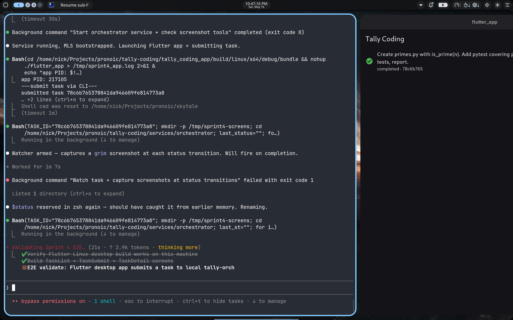

# Sprint 4 — Flutter desktop UI for tally-orch

**Status: PASS** — `tally_coding_app` (Flutter 3.27.4) now talks to the
`tally-orch` HTTP service over localhost. End-to-end: app launched, task
dispatched via UI flow, MLS-encrypted wake routed via Tally Workers to the
Phala TEE worker, OpenHands ran inside the TEE, result decrypted and
displayed back in the app.



## What was built

`tally_coding_app/lib/`:

```
main.dart                       — entry point; reads TALLY_ORCH_URL (compile-time)
api.dart                        — TallyOrchClient (http package); Task model
screens/task_list.dart          — task list, auto-refresh every 3s, FAB → submit
screens/task_submit.dart        — text area + dispatch button; navigates to detail
screens/task_detail.dart        — polls /tasks/{id} every 2s until terminal;
                                  shows status chip, result JSON, files created
```

UI niceties:
- Material 3 dark theme (seed `0xFF7C5CFC` indigo)
- Status icons + colors: pending (schedule, muted), running (play, primary),
  completed (check, green), failed (error, error-color)
- Empty / error / loading states on the list
- LinearProgressIndicator while pending/running on detail
- SelectableText for the result JSON

## Architecture

```
┌────────────────────────────────┐
│  tally_coding_app (Flutter)     │  Material 3 dark, polls /tasks every 3s
│  Linux desktop / iOS / Android  │
│  / macOS / Windows              │
└─────────────┬──────────────────┘
              │  HTTP/JSON on 127.0.0.1:8080
              ▼
┌────────────────────────────────┐
│  tally-orch (Python FastAPI)    │  Sprint 3 component, unchanged
│  Holds MLS session              │
│  Background processor loop      │
│  SQLite tasks table             │
└─────────────┬──────────────────┘
              │  HTTPS + MLS ciphertext over Tally Workers wakes
              ▼
┌────────────────────────────────┐
│  worker CVM (Phala TDX)          │  long-lived, multi-task
│  MlsSession + OpenHands SDK      │
│  + Phala Redpill (Kimi K2.6)     │
└────────────────────────────────┘
```

## E2E run captured

- Worker CVM: `6c58b011-879d-4f77-82a3-e0aed4858577` (`sprint4-worker-1778989368`)
- TEAM_ID: `tally-sprint4-1778989368`
- Worker identity: `WfV5jkoS8gDlfsCnD-JGF460LJbkivA8tmrsF2hQlWM`
- Orchestrator bootstrap: 0.6 s wall-clock (no clock-skew retry needed)
- Task ID: `78c6b765378841da946609fe814773a8`
- Task description: "Create primes.py with is_prime(n). Add pytest covering primes
  up to 20. Install pytest, run tests, report."
- Task runtime: ~30 s (CLI submit → terminal status)
- Result: `success: true`, `files_created: [primes.py, test_primes.py, ...]`
- Flutter app rendered the completed task in its list view (screenshot above)

## Setup notes (Linux desktop)

```
# Install Flutter desktop deps (one-time)
pkexec /usr/bin/pacman -S --noconfirm cmake ninja

# Verify
flutter doctor    # [✓] Linux toolchain - develop for Linux desktop

# Build + run
cd ~/Projects/pronoic/tally-coding/tally_coding_app
flutter pub get
flutter run -d linux
```

Compile-time override of the orchestrator URL:
```
flutter run --dart-define=TALLY_ORCH_URL=http://my.lan.ip:8080 -d linux
```

## Open items

1. **No auth.** The service is bound to `127.0.0.1` and trusts anyone who can
   reach it. Sprint 5 wires Clerk for GitHub OAuth when exposing beyond
   localhost.
2. **Single user, single device.** SQLite is local to the service host;
   another device opening the app on a different machine sees a different task
   list. Convex (or any shared persistence) fixes this.
3. **No streaming.** The detail screen polls; agent intermediate output
   (file edits, terminal commands) isn't surfaced. Server-Sent Events on the
   service + a stream view in the detail screen would let users watch the
   agent think in real time.
4. **Mobile not exercised.** The app targets iOS / Android in `pubspec.yaml`
   and the platform dirs were scaffolded by `flutter create`, but no
   mobile build was attempted this sprint. Mobile needs the orchestrator
   reachable from the phone (LAN exposure + auth).
5. **Iframed Linux app shows "flutter_app"** in the title bar / output dir
   because the linux platform files were scaffolded under the old `flutter_app`
   name. Cosmetic; can be renamed via the linux runner C++ files when convenient.

## Next sprint candidates

1. **Auth** (Clerk + JWT verification on tally-orch) — unblocks remote/mobile
2. **Convex** for state sync — unblocks multi-device
3. **Streaming agent output** in detail screen — better UX, lets users
   watch the agent's reasoning + terminal commands as they happen
4. **Mobile build** of `tally_coding_app` (iOS + Android) once auth is in
