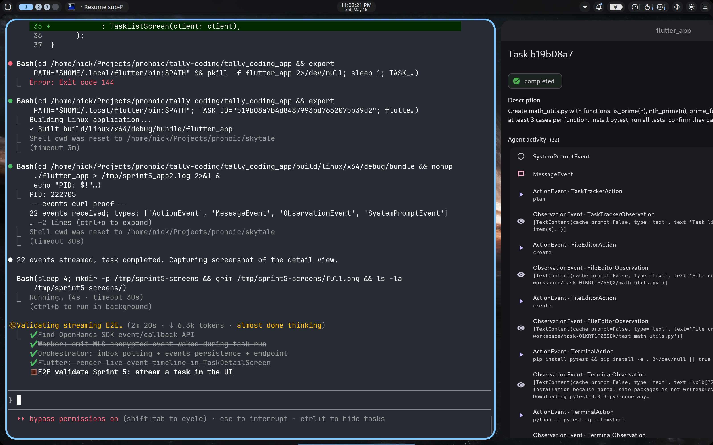

# Sprint 5 — Streaming agent events to the UI

**Status: PASS** — The worker now MLS-encrypts each OpenHands event
(`ActionEvent`, `ObservationEvent`, `MessageEvent`, `SystemPromptEvent`) and
streams it back to the orchestrator as a separate wake. The orchestrator
persists each event and the Flutter detail screen renders a live timeline.



## What was built

**Worker (`spike/day4/worker/worker_spike.py`)** — task wake payload now carries
the orchestrator's bearer and the orchestrator-assigned `task_id`. When a task
arrives, the worker:

1. Spins up a daemon thread (`event-emitter`) that consumes a `queue.Queue`
2. Passes a `callbacks=[on_event]` callback to `Conversation(...)`
3. Runs `conversation.run()` on the main thread
4. The callback `event_summary()`-reduces each OpenHands event to a compact
   dict and puts it on the queue (non-blocking)
5. The emitter thread `session.encrypt()` + `dispatch_wake(task:event, ...)`
   to the orchestrator's bearer
6. After the conversation finishes, queue is poisoned with a shutdown sentinel
   and the thread joins

The MLS sender ratchet is single-writer on the worker side: only the emitter
thread calls `session.encrypt()`. The main thread's final `session.encrypt()`
for the result happens after the emitter thread has joined.

**Orchestrator (`services/orchestrator/tally_orchestrator/service.py`):**
- Registers `task:event` context on its own bearer at bootstrap
- New `events` table: `(task_id, seq) PRIMARY KEY, event_json, received_at`
- New asyncio task `run_event_poller_loop`: long-polls the orchestrator's
  inbox, decrypts each event wake, persists, acks the wake. Runs alongside
  the existing `run_processor_loop`
- New endpoint `GET /tasks/{task_id}/events?since_seq=N` returning events
  with `seq > N` (for incremental polling from the UI)

**Flutter app (`tally_coding_app/lib/screens/task_detail.dart`):**
- `_TaskDetailScreenState` tracks `_events: List<Map>` + `_lastSeq`
- Each 2 s poll fetches `getTask` + `listEvents(sinceSeq: _lastSeq)`
  concurrently via `Future.wait`
- Appends new events, advances `_lastSeq`
- Renders an "Agent activity" card with one `ListTile` per event:
  type-specific icon and color, monospace body text for command / path /
  content / output (truncated at 200 chars in the UI, 500 on the wire)

## E2E run

- Worker CVM: `8aa91b6e-2eb7-4d45-8e90-33b5a6d76445` (`sprint5-worker-1778990242`)
- TEAM_ID: `tally-sprint5-1778990242`
- Worker identity: `zIju_af30Xzdcb915yHYowEUHuewyh4Q5SjWvg3kNxo`
- Orchestrator bearer (auto): `kaq5NFQKdxU6fq-iMLA_BHPZVMr3fb8F_6AfxF_mvyM`
- Bootstrap: 0.7 s
- Task: "Create math_utils.py with functions: is_prime(n), nth_prime(n),
  prime_factors(n), gcd(a, b). Write pytest tests with at least 3 cases per
  function. Install pytest, run all tests, confirm they pass."
- Task ID: `b19b08a7b4d8487993bd765207bb39d2`
- **22 events streamed**, types: `ActionEvent`, `MessageEvent`,
  `ObservationEvent`, `SystemPromptEvent`
- Final status: completed, `success: true`

Every event was its own MLS-encrypted wake through Tally Workers. The
orchestrator's inbox handler decrypted and persisted each one within ~1 s
of the worker emitting it. The Flutter UI saw the events on its next 2 s
poll.

## Wire-level: what tally-workers carried

```
POST /v1/teams/.../wakes  context_id=mls:bootstrap   ×2   (plaintext, public MLS artifacts)
POST /v1/teams/.../wakes  context_id=task:start      ×1   (ciphertext, ~290 bytes)
POST /v1/teams/.../wakes  context_id=task:event      ×22  (ciphertext, ~300-600 bytes each)
```

For ~110 s of task time, that's roughly 1 wake every 5 s — burstier when the
agent is producing observations (tool outputs). Tally Workers sees ciphertext
exclusively for the task content and the per-event payloads.

## Open items

1. **Polling, not SSE.** The Flutter app polls `/events` every 2 s. Each new
   batch is appended client-side. Server-Sent Events would cut UI latency
   to "instant" (subject to network jitter) and remove the 2 s round-trip
   pause. Considered for Sprint 6.
2. **No event reordering / dedup logic on the client.** Server's
   `INSERT OR IGNORE` handles duplicates if a wake is re-delivered, but the
   client trusts the server's ordering. If wakes arrive out of order on the
   orchestrator (possible if tally-workers reorders concurrent deliveries),
   client would render them out of order. Not seen in practice; add a sort
   if it becomes a problem.
3. **Event truncation.** Bodies truncated at 500 chars on the worker side.
   Long tool outputs (e.g., full pytest log) only show the first 500 chars
   in the timeline. Acceptable for the spike; future: streamed multi-frame
   events for long outputs.
4. **No event hooks for streaming LLM deltas.** OpenHands has
   `token_callbacks: list[ConversationTokenCallbackType]` for per-token
   streaming — wiring that would turn the timeline into "watch the agent
   think character-by-character." Bigger UX upgrade.

## Files changed

- `spike/day4/worker/worker_spike.py` (+90 / -10): event callback, emitter thread, event_summary
- `services/orchestrator/tally_orchestrator/service.py` (+70): events table, inbox poller, /events endpoint
- `tally_coding_app/lib/api.dart` (+10): `listEvents()`
- `tally_coding_app/lib/screens/task_detail.dart` (+50): events state, timeline UI
- `tally_coding_app/lib/main.dart` (+10): TALLY_OPEN_TASK_ID deep-link for screenshots/dev

Image bump: `ghcr.io/nicholasraimbault/tally-spike-day4-worker:v6`.

## Next sprint candidates

1. **SSE** for true real-time event delivery to the UI
2. **Token-level streaming** via `token_callbacks` (watch the agent think)
3. **Clerk auth** + remote exposure of `tally-orch` (so the app can run on
   another device)
4. **Worker pool + per-user MLS sessions** for multi-user
