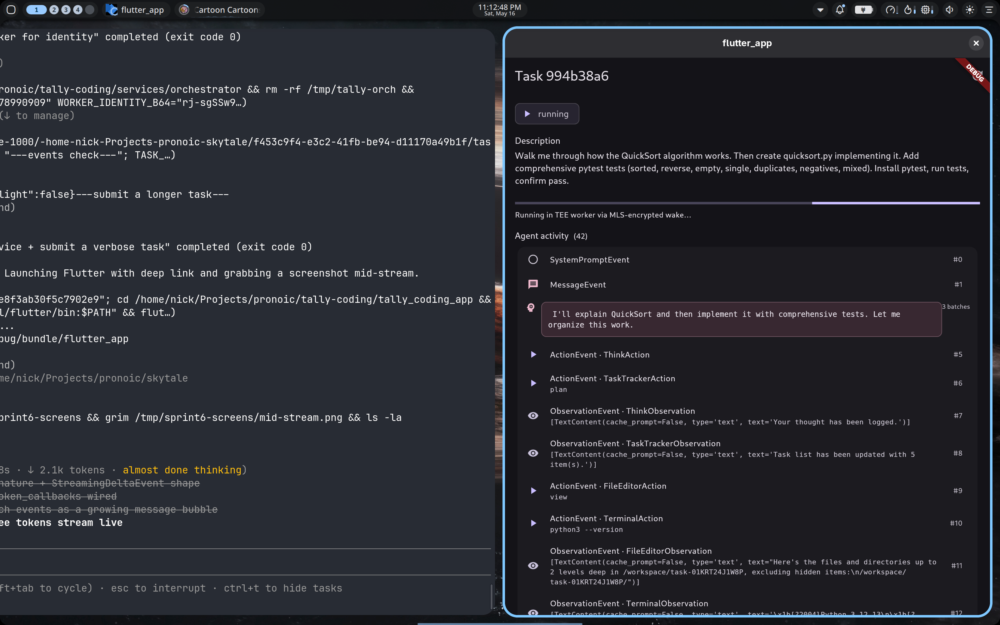
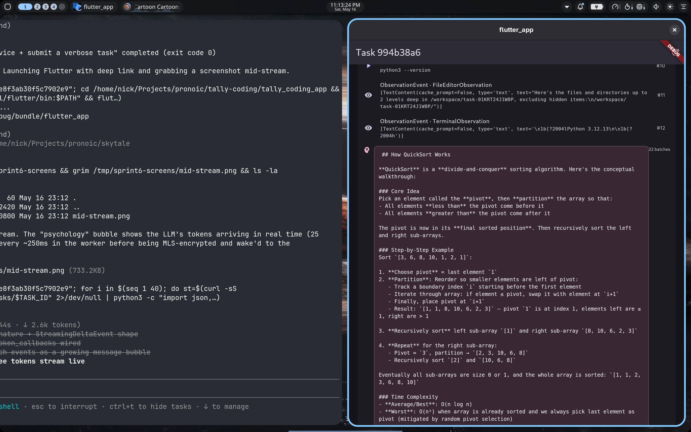

# Sprint 6 — Token-level streaming end-to-end

**Status: PASS** — The worker now streams the LLM's per-token deltas (batched
every ~250 ms) through the same MLS-encrypted wake pipeline as Sprint 5's
agent events. Flutter renders consecutive `TokenBatch` events as a single
growing message bubble with a blinking cursor while the stream is live.

| Mid-stream | Completed |
|---|---|
|  |  |

## What was built

**Worker (`spike/day4/worker/worker_spike.py`):**

- `LLM(..., stream=True)` — required for `token_callbacks` to fire; without
  it the LLM runs in one-shot completion mode and never calls the callback.
- New `TokenBatcher` class:
  - `on_chunk(chunk)` callback registered as `Conversation(token_callbacks=[...])`
  - Buffers `chunk.choices[0].delta.content` strings
  - Flushes when buffer ≥ 200 chars OR ≥ 250 ms since last flush
  - Daemon `token-batcher` thread runs a 100 ms `should_flush?` check so the
    last tokens of a quiet stream don't sit unflushed
  - `flush()` enqueues a `{type: "TokenBatch", content, ts}` onto the same
    `event_queue` the agent-event callback uses
- The agent `on_event` callback `batcher.flush()`-es **before** putting the
  next non-token event on the queue. This preserves causal order: every
  TokenBatch always emerges before the ActionEvent / ObservationEvent that
  follows it.
- `batcher.stop()` runs in the task `finally` so the last partial batch
  always reaches the orchestrator before the result wake.

**No service-side changes needed.** TokenBatch is just another event type;
the existing `events` table + `task:event` inbox handler + `/tasks/{id}/events`
endpoint carry them transparently.

**Flutter (`tally_coding_app/lib/screens/task_detail.dart`):**

- `_renderTimeline()` walks `_events` linearly and groups any contiguous run
  of `TokenBatch` events into a single `_tokenBubble()` widget. Non-token
  events render as the existing `_eventTile`.
- `_tokenBubble()` concatenates the `content` of each batch in the run into
  one monospace text block in a tertiary-color rounded container. The
  "psychology" icon distinguishes it from action / observation rows.
- A `_BlinkingCursor` widget (FadeTransition on `▌`) appears at the end of
  the most recent bubble while the task is still `pending` / `running`.

## E2E run

- Worker CVM: `f4d692e5-f763-4ded-a61d-796c15a0585a` (`sprint6-worker-1778990909`)
- TEAM_ID: `tally-sprint6-1778990909`
- Worker identity: `rj-sgSSw92vmRLn2rUstL1YJpcQBLr1L4UxIxXLRFwc`
- Bootstrap: ~0.7 s (no clock-skew retry)
- Task: "Walk me through how the QuickSort algorithm works. Then create
  quicksort.py implementing it. Add comprehensive pytest tests (sorted,
  reverse, empty, single, duplicates, negatives, mixed). Install pytest,
  run tests, confirm pass."
- Task runtime: ~75 s
- **49 events total** (24 non-token + 25 `TokenBatch`)
- **1 524 chars** of LLM text streamed across the 25 batches
  (avg ~61 chars/batch, well within the 200-char + 250-ms thresholds)

## Throughput notes

Without batching, a 50 tok/s LLM would mean ~50 wakes/sec — every chunk a
separate HTTP round-trip + MLS encrypt + orchestrator decrypt + SQLite
insert. With 200-char / 250-ms batching, the spike saw ~3 TokenBatch
events/second steady-state during streaming bursts. Compares to the worker's
non-token wake rate (~0.3/s for ActionEvent + ObservationEvent), so streaming
adds roughly a 10× wake load — manageable but worth keeping the batch
threshold non-aggressive.

## Wire-level: what tally-workers carried

```
POST /v1/teams/.../wakes  context_id=mls:bootstrap   ×2   (plaintext, MLS bootstrap)
POST /v1/teams/.../wakes  context_id=task:start      ×1   (ciphertext, ~290 bytes)
POST /v1/teams/.../wakes  context_id=task:event      ×49  (ciphertext, ~300-700 bytes each)
                                                     of which 25 are TokenBatch
```

Tally Workers never saw the LLM's tokens in plaintext. Each TokenBatch is
MLS-encrypted on the worker side; only the orchestrator with the matching
group state can decrypt.

## Open items

1. **Polling on the Flutter side** (still). SSE would make the cursor
   blink-and-grow feel truly instant. The 2 s poll means visible "tear" as a
   batch lands. Sprint 7 candidate.
2. **No display of `reasoning_content`.** OpenHands' `StreamingDeltaEvent`
   has a `reasoning_content` field for thinking traces (Kimi K2.6 doesn't
   expose them; other models would). Easy to add to `event_summary()` later.
3. **`SystemPromptEvent` is huge.** The full system prompt (~7 KB) gets
   truncated at 500 chars when summarized, but the event itself still costs
   one wake at boot. Could skip it in the worker.
4. **Stream interleaving with tool calls.** When the agent emits a tool call
   after some thinking text, the TokenBatch bubble closes and the
   ActionEvent appears — correctly ordered. But if a tool call interrupts
   mid-sentence, the partial bubble looks unfinished. Acceptable today;
   future: explicit "stream end" marker.

## Files changed

- `spike/day4/worker/worker_spike.py` (+90 / -10): TokenBatcher, `stream=True`,
  `token_callbacks` wired
- `tally_coding_app/lib/screens/task_detail.dart` (+90): `_tokenBubble`,
  `_renderTimeline`, `_BlinkingCursor`
- Image: `ghcr.io/nicholasraimbault/tally-spike-day4-worker:v7`

## Next sprint candidates

1. **SSE** on `tally-orch` (replaces the 2 s polling) — truly instant token
   rendering
2. **Clerk auth** + remote `tally-orch` exposure (LAN, then internet) — first
   step toward the mobile build
3. **Worker pool** — concurrent tasks; would need MLS-session-per-task
4. **Per-task workspace inspection** — let the UI browse files the agent
   created
