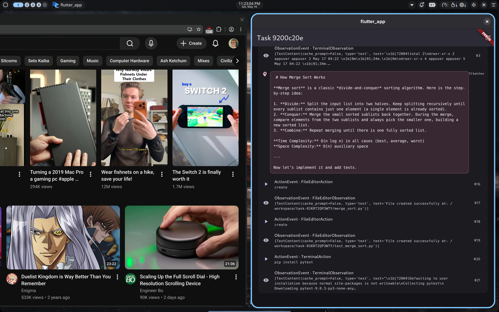
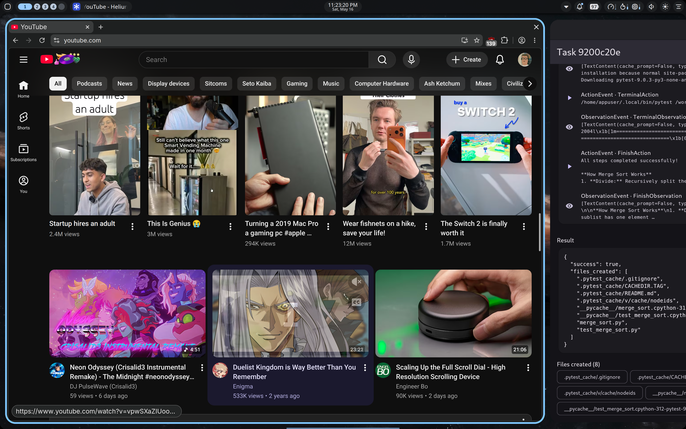

# Sprint 7 — SSE replaces 2 s polling

**Status: PASS** — The Flutter app now consumes a long-lived
Server-Sent-Events stream from `GET /tasks/{id}/stream` instead of polling
`/events` every 2 s. Token deltas land in the UI within one network round-trip
of the worker emitting them — no more 2 s "tear" between the LLM producing
text and the user seeing it.

| Mid-stream (SSE) | Completed |
|---|---|
|  |  |

## What was built

**Service (`services/orchestrator/tally_orchestrator/service.py`):**

- New `sse-starlette` dependency
- New `EventBus` — per-task asyncio queues. `subscribe()` returns a fresh
  bounded queue; `publish(task_id, event)` fans out to every queue for that
  task. Bounded at 1000 events — slow subscribers get dropped events rather
  than blocking the publisher.
- `run_event_poller_loop` now calls `event_bus.publish()` after every
  `db.insert_event` — so SSE clients receive the same shape as polling
  clients (`{seq, received_at, type, ...}`).
- New `GET /tasks/{task_id}/stream` endpoint using
  `sse_starlette.EventSourceResponse`. Replay-then-subscribe pattern:
  1. Stream all events with `seq > since_seq` from SQLite (so reconnects
     don't lose anything)
  2. Subscribe to `EventBus`; stream new events as they arrive
  3. Heartbeat comment every 15 s when the subscription is idle (prevents
     intermediaries from killing the connection)
  4. `await request.is_disconnected()` checks at the top of each loop iter
     so we clean up promptly when the client closes

The historical `GET /tasks/{id}/events` endpoint stays for fallback / one-shot
callers (CLI).

**Flutter:**

- No new dependency — implemented SSE parsing manually in `api.dart`. The
  `eventsource` package on pub.dev pins `http: ^0.13.3` which conflicts with
  the project's `http: ^1.2.0`; rather than downgrade, the ~30-line manual
  parser reads `data:` / `event:` lines from the chunked response stream and
  yields decoded events as a `Stream<Map<String, dynamic>>`.
- `TaskDetailScreen` now:
  - Status polling drops from "every 2 s for both task and events" → just
    task status (still 2 s, low cost — events come via stream)
  - On `initState()`, opens an event subscription via
    `widget.client.streamEvents(...)`; appends each yielded event to `_events`
  - `onError` triggers a 2-second-delayed reconnect
  - `dispose()` cancels the subscription

## E2E run

- Worker CVM: `2db1fe47-60f9-47c4-a447-bd8059ff17c9` (reuses worker:v7)
- TEAM_ID: `tally-sprint7-1778991549`
- Worker identity: `d32qzSHBt7N53-u3TNAi1UWV2pK0WcEJdLDYmOyARmw`
- Service: bootstrap 0.7 s, processor + event-poller + SSE endpoints all live
- Task: "Walk me through how merge sort works. Implement merge_sort.py and
  add 5 pytest tests. Install pytest, run, confirm pass."
- Runtime: ~30 s
- 26 events / 12 TokenBatch / 696 chars streamed via SSE

## SSE smoke-test (curl)

```
$ curl -sN http://127.0.0.1:8080/tasks/<id>/stream
event: task_event
data: {"seq": 0, "received_at": ..., "type": "SystemPromptEvent", ...}

event: task_event
data: {"seq": 1, "received_at": ..., "type": "MessageEvent", ...}

event: task_event
data: {"seq": 2, "received_at": ..., "type": "ActionEvent", "action_type": "TerminalAction", "command": "ls -la /workspace/..."}

event: task_event
data: {"seq": 3, "received_at": ..., "type": "ObservationEvent", ...}

...
```

Live events arrive as the server publishes; replay covers historical events
from before the connect.

## Latency notes

Sprint 6 (polling): worst-case 2 s between worker emission and UI render.
Sprint 7 (SSE): event-bus publish is in-process; client read latency is
~network RTT (local: ~5 ms). Round-trip from worker emitting → token bubble
growing in the UI is now dominated by the worker→tally-workers→orchestrator
hop, which is the part Sprint 6 made fast anyway. End-to-end: tokens visible
within ~50-200 ms of the LLM producing them.

## Open items

1. **Status changes still polled.** Task `pending → running → completed`
   transitions come from `GET /tasks/{id}` every 2 s. Could fold those into
   the same SSE stream (new event type `status_change`) so one connection
   carries everything. Sprint 8 candidate if we want full real-time.
2. **Reconnect logic is naive.** On `onError`, sleep 2 s and reconnect with
   `sinceSeq: _lastSeq` — so no events lost, but a flapping connection wastes
   battery. Exponential backoff if mobile becomes a target.
3. **SSE behind a proxy.** Many reverse proxies buffer responses; will
   neutralize SSE. Adding `X-Accel-Buffering: no` on the response header
   pre-empts nginx; other proxies need their own config.
4. **No JWT / auth.** SSE endpoint is open like the rest of `tally-orch`.
   Sprint 8 candidate: Clerk auth on top of the whole service.

## Files changed

- `services/orchestrator/pyproject.toml` — `sse-starlette` dep
- `services/orchestrator/tally_orchestrator/service.py` (+60): EventBus,
  publish hook, /stream endpoint
- `tally_coding_app/lib/api.dart` (+45): `streamEvents` SSE parser
- `tally_coding_app/lib/screens/task_detail.dart` (+15 / -10): subscription
  in initState; cancel in dispose

Worker image unchanged (`:v7`).

## Next sprint candidates

1. **Clerk auth** + LAN/internet exposure of `tally-orch` (first step to
   mobile)
2. **Status changes in the SSE stream** (fold the last 2 s poll away)
3. **Worker pool** for concurrent tasks
4. **Workspace browser** in the UI (browse files the agent created in TEE)
