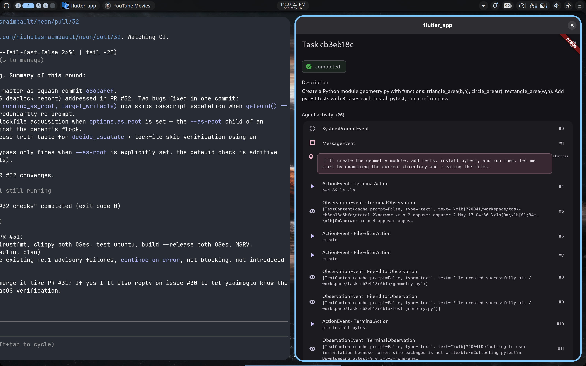
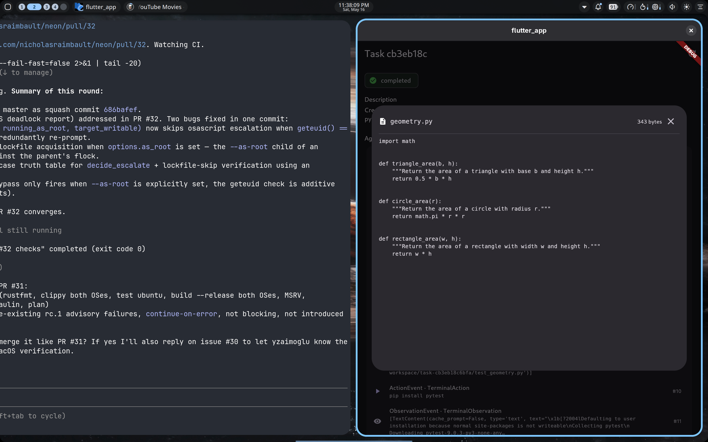

# Sprint 8 — Workspace browser + status in SSE

**Status: PASS** — Two adjacent additions: (1) the user can now click any
created file to view its contents (read live from inside the TEE worker over
an MLS-encrypted fs:read wake); (2) task status transitions arrive in the
same SSE stream as events, removing the last 2 s status poll.

| Detail screen | File viewer dialog |
|---|---|
|  |  |

## Workspace browser

**Worker** registers two new context handlers post-bootstrap:
- `task:fs:list` — payload `{task_id}`, returns
  `{task_id, entries: [{path, size, is_dir}, ...]}` walking the per-task
  workspace recursively.
- `task:fs:read` — payload `{task_id, path}`, returns
  `{content_b64, size, truncated}` for a single file. 256 KiB cap on the
  read, and `Path.resolve()` + prefix check refuses any `..`-based path
  traversal outside the task workspace.

The workspace dir is now keyed by `task_id` (not `wake_id`) so the
orchestrator can look up files by the same id the UI uses:
`/workspace/task-<task_id[:12]>/`.

**Service** adds:
- `Orchestrator.list_workspace(task_id)` and `.read_workspace_file(task_id, path)`
  — both async, holding the dispatch lock so they don't interleave with a
  running task (MLS ratchet is single-writer).
- Endpoints `GET /tasks/{task_id}/files` and
  `GET /tasks/{task_id}/files/{path:path}`. The `{path:path}` route converter
  accepts slashes in the path so nested paths work.

**Flutter**: each entry in the existing "Files created" Wrap is now an
`ActionChip` with `Icons.description`. Tapping opens
`_FileViewerDialog`, which fetches the file contents via
`client.readFile(taskId, path)` and renders the decoded UTF-8 in a scrollable
`SelectableText` with monospace font.

End-to-end verified by curling the new endpoints during the Sprint 8 run:

```
$ curl http://127.0.0.1:8080/tasks/<id>/files
{ "task_id": "...", "entries": [
    {"path": "geometry.py", "size": 343, "is_dir": false},
    {"path": "test_geometry.py", ...}, ...
]}

$ curl http://127.0.0.1:8080/tasks/<id>/files/geometry.py
{ "size": 343, "truncated": false, "content_b64": "..." }
  → decodes to:
    import math

    def triangle_area(b, h):
        """Return the area of a triangle with base b and height h."""
        return 0.5 * b * h

    def circle_area(r):
        ...
```

## Status in SSE

**Service**: every `db.mark_running` / `mark_completed` / `mark_failed` call
in `Orchestrator.process_task` is now followed by a `_publish_status(...)`
that puts a `_kind: "status_change"` record on the EventBus. The SSE
endpoint distinguishes between record kinds and emits them with the
appropriate SSE `event:` name:

```
event: task_event
data: {"seq": 0, "type": "SystemPromptEvent", ...}

event: task_event
data: {"seq": 1, ...}

event: status_change
data: {"task_id": "...", "status": "running", "ts": ...}

event: task_event
data: {"seq": 2, ...}

...

event: status_change
data: {"task_id": "...", "status": "completed", "success": true, "ts": ...}
```

On connect, the SSE endpoint also emits a one-shot `status_change` snapshot
so a freshly-connected client converges on current status without a separate
HTTP call.

**Flutter**: `streamFrames` (renamed from `streamEvents`) now yields tagged
records `({String name, Map data})`. The detail screen routes by `name`:
`task_event` → append to timeline, `status_change` → splice into the local
`_task` (preserving description / result fields). When status flips to a
terminal value the screen does one more `getTask` to pick up the final
`result` / `error`.

The 2 s status polling timer is gone. The only HTTP outside the SSE stream
is the one-shot `_fetchInitial()` on screen mount.

## E2E run

- Worker CVM: `c15c9835-3f83-4b80-aabe-696516639812` (`sprint8-worker-1778992377`)
- TEAM_ID: `tally-sprint8-1778992377`
- Worker identity: `EXkPPbBES-VoOFLJ7ht_yhUad8ZYy93rNLXXf2Ccp4g`
- Task: "Create a Python module geometry.py with functions: triangle_area(b,h),
  circle_area(r), rectangle_area(w,h). Add pytest tests with 3 cases each.
  Install pytest, run, confirm pass."
- Task ID: `cb3eb18c6bfa470ca02e0bbcce20efdd`
- Runtime: ~25 s end-to-end
- Files created: `geometry.py` (343 B), `test_geometry.py`, plus pytest caches
- File viewer rendered the real Python source returned from the TEE

## Wire-level

Two new wake types added per task:
```
POST /v1/teams/.../wakes  context_id=task:fs:list    on user click of "View files"
POST /v1/teams/.../wakes  context_id=task:fs:read    on user click of a file chip
```

Both MLS-encrypted; tally-workers carries ciphertext only. The response
ciphertext is decrypted by the orchestrator's `MlsSession`.

## Open items

1. **No file tree.** The current viewer shows only files explicitly mentioned
   in the task result's `files_created` array. The `/files` endpoint returns
   the full recursive listing — wiring a true tree view in the UI (with
   `__pycache__`, `.pytest_cache`, etc. collapsed by default) is a Sprint 9
   candidate.
2. **Text-only viewer.** Binary files would render as garbled UTF-8 (we use
   `allowMalformed: true`). A magic-byte check on the worker side could
   return a different response for binaries; UI could show a "binary file
   (N bytes)" placeholder.
3. **Reads block on a running task.** Worker handles one wake at a time, so a
   `/files/<x>` request while the agent is mid-task waits. Mitigation:
   workspace dir survives the agent run, so this is mostly a "view files of
   the currently-active task" issue. Fixable with a worker-side fs read
   thread that doesn't fight the main inbox loop.
4. **Status changes aren't persisted.** They live only on the bus, so a
   reconnecting client gets the current status snapshot but misses the
   `running` → `completed` transition timing. Not load-bearing for UI today.

## Files changed

- `spike/day4/worker/worker_spike.py` (+90): task_id-keyed workspace,
  fs:list/fs:read handlers, registration of both new contexts post-bootstrap
- `services/orchestrator/tally_orchestrator/service.py` (+90): status
  publish, new SSE event-kind routing, list_workspace/read_workspace_file,
  /files endpoints
- `tally_coding_app/lib/api.dart` (+50): `streamFrames` (tagged), `listFiles`,
  `readFile`
- `tally_coding_app/lib/screens/task_detail.dart` (+90): status_change
  splice into `_task`, ActionChip + `_FileViewerDialog`,
  `TALLY_AUTO_OPEN_FILE` deep-link for screenshots

Image: `ghcr.io/nicholasraimbault/tally-spike-day4-worker:v8`.

## Next sprint candidates

1. **Workspace tree view** with collapsible dirs (replaces the chip wrap)
2. **Clerk auth** + LAN/internet exposure of `tally-orch`
3. **Worker pool** — concurrent tasks; MLS-session-per-worker
4. **Diff view** for follow-up tasks (agent modifies an existing file)
