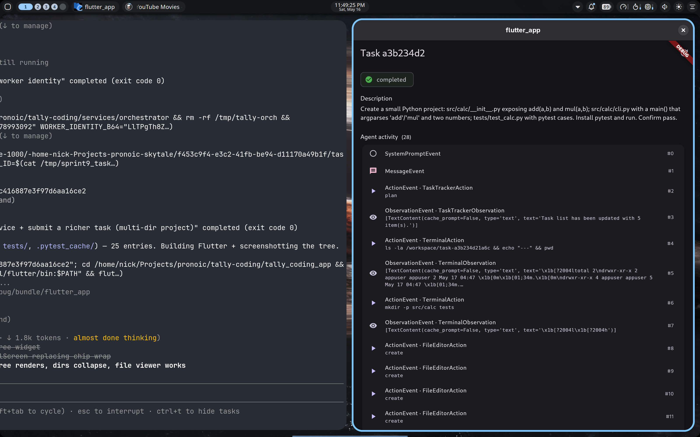

# Sprint 9 — Workspace tree view

**Status: PASS** — The Files-Created chip wrap is replaced with a proper
collapsible tree built from the full `GET /tasks/{id}/files` listing.
Multi-directory projects render with nested dirs; noise dirs
(`__pycache__`, `.pytest_cache`, etc.) start collapsed and muted.



## What was built

Flutter-only sprint — the worker's `fs:list` from Sprint 8 already returns
the full recursive entries, so no worker/service changes were needed.

**`lib/screens/file_tree.dart`** (new):

- `FileTreeNode` — recursive data class. `FileTreeNode.build(entries)` parses
  the flat `[{path, size, is_dir}, ...]` from the service into a nested tree,
  inferring parent dirs from path segments. Sort: dirs before files, then
  case-insensitive name.
- `FileTreeView` — renders the root's children with no padding wrapper so the
  enclosing Card doesn't double-indent.
- `_Node` — recursive widget. Dirs are `ExpansionTile`s with a folder icon
  in tertiary color; files are `ListTile`s with a description icon, monospace
  name, human-readable size on the trailing edge. 16 px indent per depth.
- `_kNoiseDirs` (= `{__pycache__, .pytest_cache, .git, .venv, venv,
  node_modules, .mypy_cache, .ruff_cache}`) — start collapsed and rendered
  in the muted `onSurfaceVariant` color so the user's actual files visually
  dominate.

**`lib/screens/task_detail.dart`**:

- New state: `_files` (the flat entries list), `_filesError`, `_filesLoading`
- `_fetchFiles()` calls `client.listFiles(taskId)`; bails if already loading
- `_fetchInitial()` auto-kicks `_fetchFiles()` whenever it sees a terminal
  task without files loaded yet (mounting the page on a completed task, or
  the SSE status flipping to terminal — both call `_fetchInitial`)
- The "Files created (N)" chip wrap is replaced with a "Workspace" header +
  loading spinner / error card / `FileTreeView` rendered in a `Card`
- Refresh button in the header re-fetches the tree manually

## E2E run

- Worker CVM: `890f248f-d779-4d92-8b16-4f29e06d8393` (reuses worker:v8)
- TEAM_ID: `tally-sprint9-1778993092`
- Worker identity: `LlTPgTh8ZG3Gs5WSgkDsZAUXyphOMzJULUR6cgnBI08`
- Task: "Create a small Python project: src/calc/__init__.py exposing
  add(a,b) and mul(a,b); src/calc/cli.py with a main() that argparses
  'add'/'mul' and two numbers; tests/test_calc.py with pytest cases.
  Install pytest and run. Confirm pass."
- Task ID: `a3b234d21a6c416887e3f97d6aa16ce2`
- Runtime: ~60 s
- 25 workspace entries returned from `fs:list`, structure:
  ```
  pyproject.toml         221 B
  src/
    calc/
      __init__.py        144 B
      cli.py             909 B
      __pycache__/       (collapsed)
  tests/
    test_calc.py
    __pycache__/         (collapsed)
  .pytest_cache/         (collapsed)
  ```

## Files changed

- `tally_coding_app/lib/screens/file_tree.dart` (new, ~110 LoC)
- `tally_coding_app/lib/screens/task_detail.dart` (+40 / -15): state for
  files, auto-fetch on terminal, replace chip wrap with tree view

No service / worker / Docker changes. Image: `:v8` unchanged.

## Open items

1. **No expand-all / collapse-all** controls. With a large workspace the user
   might want to fan everything out (or hide all). Small icon button in the
   header could do it.
2. **No file-search**. For projects with hundreds of files, a search box
   that filters the tree would help.
3. **Reads still serialize against the running task.** Same as Sprint 8 —
   the worker is single-handler. Doesn't bite for completed tasks; would
   bite if a user opens files while a long task is running.
4. **No directory open in viewer.** Tapping a directory toggles the
   ExpansionTile; tapping a file opens the viewer. Could add a "view as
   text" button on the dir tile that concatenates all text files (cool but
   probably overkill).

## Next sprint candidates

1. **Clerk auth + LAN/internet exposure** of `tally-orch` — first step to
   running the app on a phone
2. **Worker pool** — concurrent tasks; would need MLS session per worker
3. **Diff view** for follow-up tasks (agent modifies existing files in a
   re-run)
4. **Tree search / filter** + expand-all controls (small polish on top of
   today's tree)
